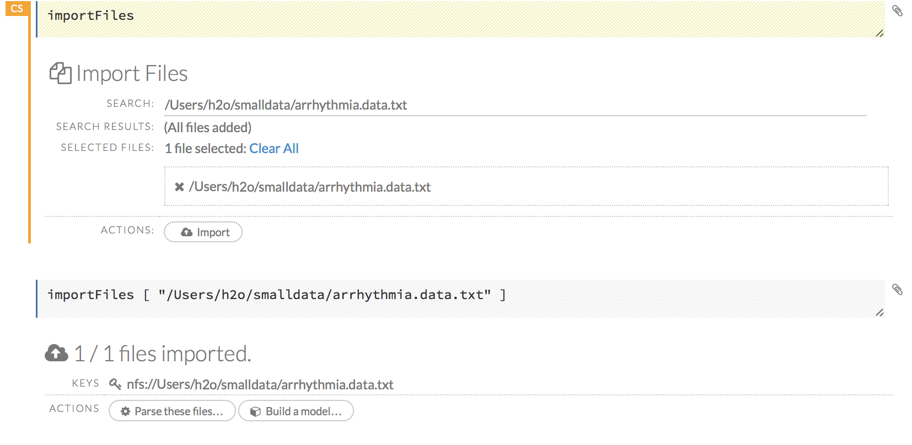
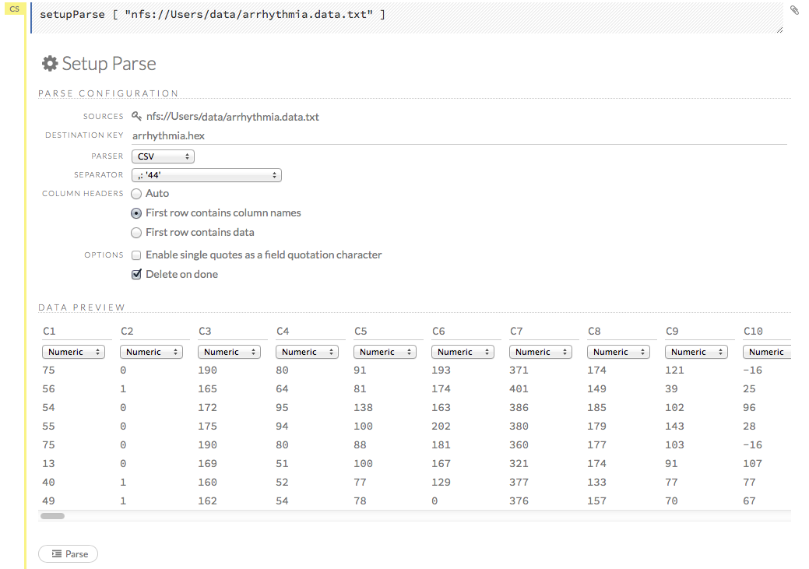
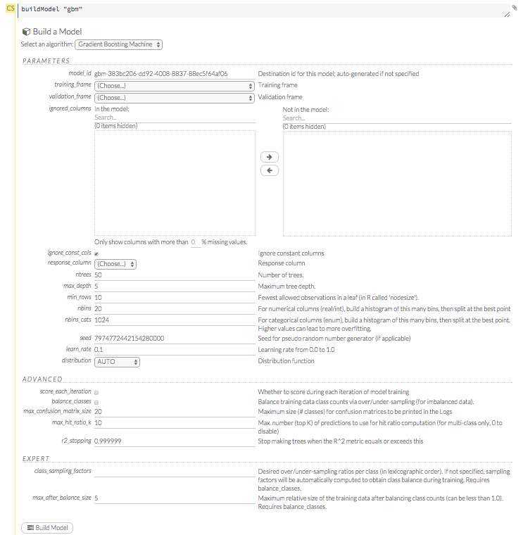
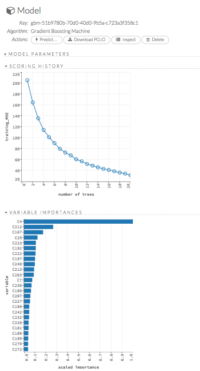
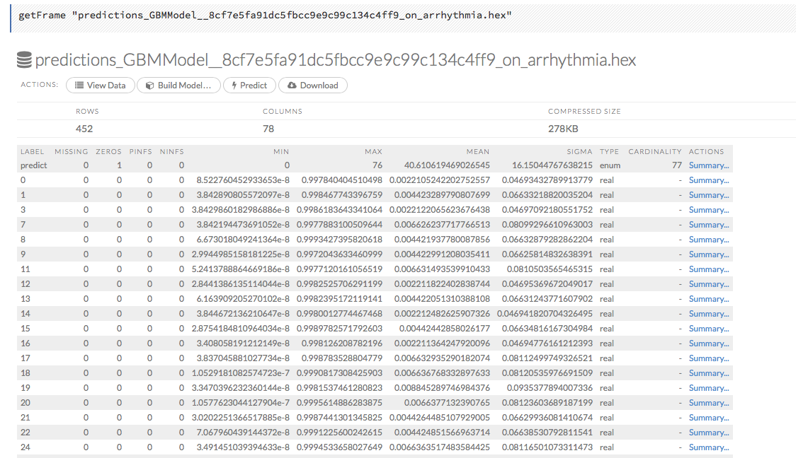

# GBM Tutorial

The purpose of this tutorial is to walk new users through a GBM analysis in H2O Flow. 

Those who have never used H2O before should refer to <a href="https://github.com/h2oai/h2o-dev/blob/master/h2o-docs/src/product/flow/README.md" target="_blank">Getting Started</a> for additional instructions on how to run H2O Flow.

## Getting Started

This tutorial uses a publicly available data set that can be found at:
<ahref="http://archive.ics.uci.edu/ml/datasets/Arrhythmia" target="_blank">http://archive.ics.uci.edu/ml/datasets/Arrhythmia</a>.

The original data are the Arrhythmia data set made available by UCI
Machine Learning repository. They are composed of 452 observations and 279 attributes.

If you don't have any data of your own to work with, you can find some example datasets here: 

- <a href="http://docs.h2o.ai/h2oclassic/resources/publicdata.html"  target="_blank">http://docs.h2o.ai/h2oclassic/resources/publicdata.html </a>
- <a href="http://data.h2o.ai" target="_blank">http://data.h2o.ai</a>

###Importing Data
Before creating a model, import data into H2O:

0. Click the **Assist Me!** button (the last button in the row of buttons below the menus). 

 
0. Click the **importFiles** link and enter the file path to the dataset in the **Search** entry field. 
0. Click the **Add all** link to add the file to the import queue, then click the **Import** button. 
  

###Parsing Data
Now, parse the imported data: 

0. Click the **Parse these files...** button. 

 >**Note**: The default options typically do not need to be changed unless the data does not parse correctly. 

0. From the drop-down **Parser** list, select the file type of the data set (Auto, XLS, CSV, or SVMLight). 
0. If the data uses a separator, select it from the drop-down **Separator** list. 
0. If the data uses a column header as the first row, select the **First row contains column names** radio button. If the first row contains data, select the **First row contains data** radio button. You can also select the **Auto** radio button to have H2O automatically determine if the first row of the dataset contains the column names or data. 
0. If the data uses apostrophes ( `'` - also known as single quotes), check the **Enable single quotes as a field quotation character** checkbox. 
0. To delete the imported dataset after the parse is complete, check the **Delete on done** checkbox. 

  >**NOTE**: In general, we recommend enabling this option. Retaining data requires memory resources, but does not aid in modeling because unparsed data can't be used by H2O.

0. Review the data in the **Data Preview** section, then click the **Parse** button.  

  

  **NOTE**: Make sure the parse is complete by confirming progress is 100% before continuing to the next step, model building. For small datasets, this should only take a few seconds, but larger datasets take longer to parse.

### Building a Model

0. Once data are parsed, click the **View** button, then click the **Build Model** button. 
0. Select `Gradient Boosting Machine` from the drop-down **Select an algorithm** menu, then click the **Build model** button. 
0. If the parsed arrhythmia.hex file is not already listed in the **Training_frame** drop-down list, select it. Otherwise, continue to the next step. 
0. From the **Ignored_columns** section, select the columns to ignore in the *Available* area to move them to the *Selected* area. For this example, do not select any columns. 
0. From the drop-down **Response** list, select column 1 (`C1`).  
0. In the **Ntrees** field, specify the number of trees to build  (for this example, `20`). 
0. In the **Max_depth** field, specify the maximum number of edges between the top node and the furthest node as a stopping criteria (for this example, use the default value of `5`). 
0. In the **Min_rows** field, specify the minimum number of observations (rows) to include in any terminal node as a stopping criteria (for this example, `25`). 
0. In the **Nbins** field, specify the number of bins to use for data splitting (for this example, use the default value of `20`). The split points are evaluated at the boundaries at each of these bins. As the value of **Nbins** increases, the algorithm approximates more closely the evaluation of each individual observation as a split point. The cost of this refinement is an increase in computational time.  
0. In the **Learn_rate** field, specify the tuning parameter (also known as shrinkage) to slow the convergence of the algorithm to a solution, which helps prevent overfitting. For this example, enter `0.3`. 
0. Click the **Build Model** button. 

  

### Viewing GBM Results

The output for GBM includes the following: 

- Model parameters (hidden)
- A graph of the scoring history (training MSE vs number of trees)
- A graph of the variable importances
- Output (model category, validation metrics, initf)
- Model summary (number of trees, min. depth, max. depth, mean depth, min. leaves, max. leaves, mean leaves)
- Scoring history in tabular format
- Training metrics (model name, model checksum name, frame name, description, model category, duration in ms, scoring time, predictions, MSE, R2)
- Variable importances in tabular format
- POJO Preview

  

For classification models, the MSE is based on the classification error within the tree. For regression models, MSE is calculated from the squared deviances, as it is in standard regressions.

###Viewing Predictions

To view predictions, click the **Predict** button. From the drop-down **Frame** list, select the arrhythmia.hex file and click the **Predict** button. 

To view more prediction data, click the **View Prediction Frame** button.

   

