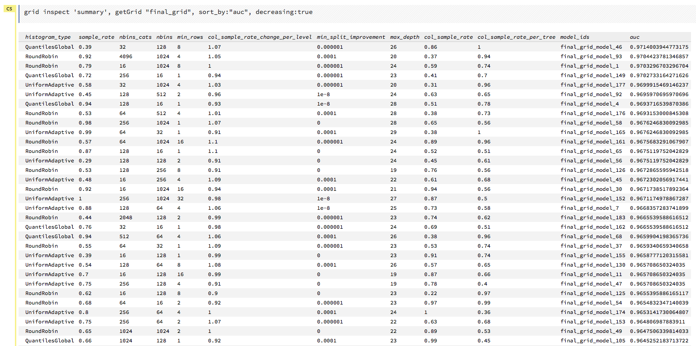
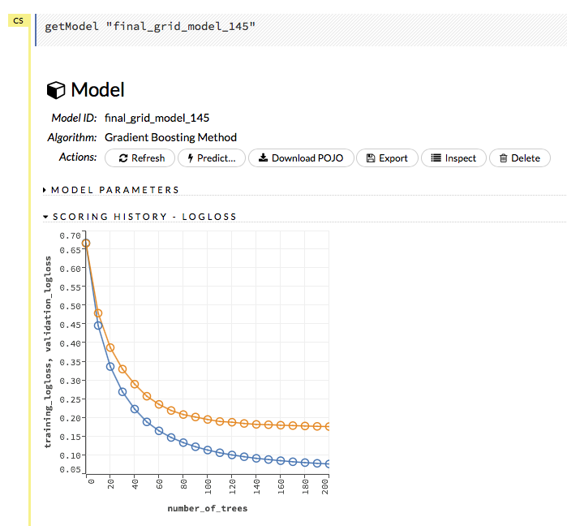
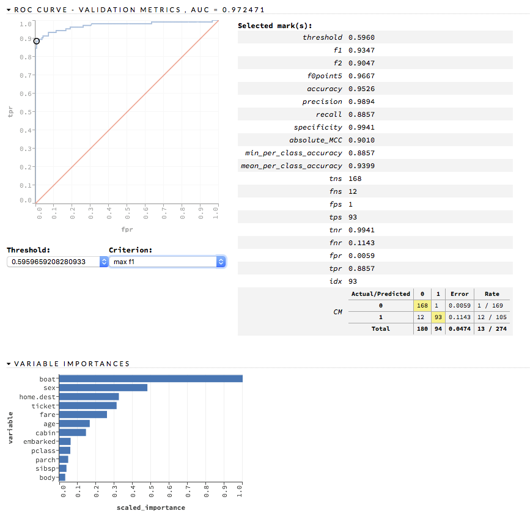

# H2O GBM Tuning Tutorial for R
### Arno Candel, PhD, Chief Architect, H2O.ai

In this tutorial, we show how to build a well-tuned H2O GBM model for a supervised classification task. We specifically don't focus on feature engineering and use a small dataset to allow you to reproduce these results in a few minutes on a laptop. This script can be directly transferred to datasets that are hundreds of GBs large and H2O clusters with dozens of compute nodes.

This tutorial is written in [R Markdown](http://rmarkdown.rstudio.com). You can download the source [from H2O's github repository](https://github.com/h2oai/h2o-3/blob/master/h2o-docs/src/product/tutorials/gbm/gbmTuning.Rmd).

Ports to [Python Jupyter Notebook](https://github.com/h2oai/h2o-3/blob/master/h2o-docs/src/product/tutorials/gbm/gbmTuning.ipynb) and [Flow UI](https://raw.githubusercontent.com/h2oai/h2o-3/master/h2o-docs/src/product/flow/packs/examples/GBM_TuningGuide.flow) (now part of Example Flows) are available as well.

## Installation of the H2O R Package
Either download H2O from [H2O.ai's website](http://h2o.ai/download) or install the latest version of H2O into R with the following R code:

```{r message=FALSE, warning=FALSE}
# The following two commands remove any previously installed H2O packages for R.
if ("package:h2o" %in% search()) { detach("package:h2o", unload=TRUE) }
if ("h2o" %in% rownames(installed.packages())) { remove.packages("h2o") }

# Next, we download packages that H2O depends on.
pkgs <- c("methods","statmod","stats","graphics","RCurl","jsonlite","tools","utils")
for (pkg in pkgs) {
  if (! (pkg %in% rownames(installed.packages()))) { install.packages(pkg) }
}

# Now we download, install and initialize the H2O package for R.
install.packages("h2o", type="source", repos=(c("http://h2o-release.s3.amazonaws.com/h2o/rel-turin/3/R")))
```

## Launch an H2O cluster on localhost

```{r message=FALSE, warning=FALSE}
library(h2o)
h2o.init(nthreads=-1)
## optional: connect to a running H2O cluster
#h2o.init(ip="mycluster", port=55555) 
```

```
Starting H2O JVM and connecting: .. Connection successful!

R is connected to the H2O cluster: 
    H2O cluster uptime:         1 seconds 593 milliseconds 
    H2O cluster version:        3.8.3.3 
    H2O cluster name:           H2O_started_from_R_arno_zlj422 
    H2O cluster total nodes:    1 
    H2O cluster total memory:   3.56 GB 
    H2O cluster total cores:    8 
    H2O cluster allowed cores:  8 
    H2O cluster healthy:        TRUE 
    H2O Connection ip:          localhost 
    H2O Connection port:        54321 
    H2O Connection proxy:       NA 
    R Version:                  R version 3.2.2 (2015-08-14) 
```

## Import the data into H2O 
Everything is scalable and distributed from now on. All processing is done on the fully multi-threaded and distributed H2O Java-based backend and can be scaled to large datasets on large compute clusters.
Here, we use a small public dataset ([Titanic](https://stat.ethz.ch/R-manual/R-devel/library/datasets/html/Titanic.html)), but you can use datasets that are hundreds of GBs large.

```{r message=FALSE, warning=FALSE}
## 'path' can point to a local file, hdfs, s3, nfs, Hive, directories, etc.
df <- h2o.importFile(path = "http://s3.amazonaws.com/h2o-public-test-data/smalldata/gbm_test/titanic.csv")
dim(df)
head(df)
tail(df)
summary(df,exact_quantiles=TRUE)

## pick a response for the supervised problem
response <- "survived"

## the response variable is an integer, we will turn it into a categorical/factor for binary classification
df[[response]] <- as.factor(df[[response]])           

## use all other columns (except for the name) as predictors
predictors <- setdiff(names(df), c(response, "name")) 
```

```
> summary(df,exact_quantiles=TRUE)
 pclass          survived        name sex         age               sibsp            parch           ticket            fare              cabin                 embarked
 Min.   :1.000   Min.   :0.000        male  :843  Min.   : 0.1667   Min.   :0.0000   Min.   :0.000   Min.   :    680   Min.   :  0.000   C23 C25 C27    :   6  S :914  
 1st Qu.:2.000   1st Qu.:0.000        female:466  1st Qu.:21.0000   1st Qu.:0.0000   1st Qu.:0.000   1st Qu.:  19950   1st Qu.:  7.896   B57 B59 B63 B66:   5  C :270  
 Median :3.000   Median :0.000                    Median :28.0000   Median :0.0000   Median :0.000   Median : 234604   Median : 14.454   G6             :   5  Q :123  
 Mean   :2.295   Mean   :0.382                    Mean   :29.8811   Mean   :0.4989   Mean   :0.385   Mean   : 249039   Mean   : 33.295   B96 B98        :   4  NA:  2  
 3rd Qu.:3.000   3rd Qu.:1.000                    3rd Qu.:39.0000   3rd Qu.:1.0000   3rd Qu.:0.000   3rd Qu.: 347468   3rd Qu.: 31.275   C22 C26        :   4          
 Max.   :3.000   Max.   :1.000                    Max.   :80.0000   Max.   :8.0000   Max.   :9.000   Max.   :3101298   Max.   :512.329   C78            :   4          
                                                  NA's   :263                                        NA's   :352       NA's   :1         NA             :1014          
 boat             body            home.dest                
 Min.   : 1.000   Min.   :  1.0   New York  NY        : 64 
 1st Qu.: 5.000   1st Qu.: 72.0   London              : 14 
 Median :10.000   Median :155.0   Montreal  PQ        : 10 
 Mean   : 9.405   Mean   :160.8   Cornwall / Akron  OH:  9 
 3rd Qu.:13.000   3rd Qu.:256.0   Paris  France       :  9 
 Max.   :16.000   Max.   :328.0   Philadelphia  PA    :  8 
 NA's   :911      NA's   :1188    NA                  :564 
```

From now on, everything is generic and directly applies to most datasets. We assume that all feature engineering is done at this stage and focus on model tuning. For multi-class problems, you can use `h2o.logloss()` or `h2o.confusionMatrix()` instead of `h2o.auc()` and for regression problems, you can use `h2o.deviance()` or `h2o.mse()`.

## Split the data for Machine Learning
We split the data into three pieces: 60% for training, 20% for validation, 20% for final testing. 
Here, we use random splitting, but this assumes i.i.d. data. If this is not the case (e.g., when events span across multiple rows or data has a time structure), you'll have to sample your data non-randomly.

```{r message=FALSE, warning=FALSE}
splits <- h2o.splitFrame(
  data = df, 
  ratios = c(0.6,0.2),   ## only need to specify 2 fractions, the 3rd is implied
  destination_frames = c("train.hex", "valid.hex", "test.hex"), seed = 1234
)
train <- splits[[1]]
valid <- splits[[2]]
test  <- splits[[3]]
```

## Establish baseline performance
As the first step, we'll build some default models to see what accuracy we can expect. Let's use the [AUC metric](http://mlwiki.org/index.php/ROC_Analysis) for this demo, but you can use `h2o.logloss` and `stopping_metric="logloss"` as well. It ranges from 0.5 for random models to 1 for perfect models.


The first model is a default GBM, trained on the 60% training split

```{r message=FALSE, warning=FALSE}
## We only provide the required parameters, everything else is default
gbm <- h2o.gbm(x = predictors, y = response, training_frame = train)

## Show a detailed model summary
gbm

## Get the AUC on the validation set
h2o.auc(h2o.performance(gbm, newdata = valid)) 
```

The AUC is over 94%, so this model is highly predictive!

```
[1] 0.9480135
```


The second model is another default GBM, but trained on 80% of the data (here, we combine the training and validation splits to get more training data), and cross-validated using 4 folds.
Note that cross-validation takes longer and is not usually done for really large datasets.

```{r message=FALSE, warning=FALSE}
## h2o.rbind makes a copy here, so it's better to use splitFrame with `ratios = c(0.8)` instead above
gbm <- h2o.gbm(x = predictors, y = response, training_frame = h2o.rbind(train, valid), nfolds = 4, seed = 0xDECAF)

## Show a detailed summary of the cross validation metrics
## This gives you an idea of the variance between the folds
gbm@model$cross_validation_metrics_summary

## Get the cross-validated AUC by scoring the combined holdout predictions.
## (Instead of taking the average of the metrics across the folds)
h2o.auc(h2o.performance(gbm, xval = TRUE))
```

We see that the cross-validated performance is similar to the validation set performance:

```
[1] 0.9485951
```

Next, we train a GBM with "I feel lucky" parameters.
We'll use early stopping to automatically tune the number of trees using the validation AUC. 
We'll use a lower learning rate (lower is always better, just takes more trees to converge).
We'll also use stochastic sampling of rows and columns to (hopefully) improve generalization.

```{r message=FALSE, warning=FALSE}
gbm <- h2o.gbm(
  ## standard model parameters
  x = predictors, 
  y = response, 
  training_frame = train, 
  validation_frame = valid,
  
  ## more trees is better if the learning rate is small enough 
  ## here, use "more than enough" trees - we have early stopping
  ntrees = 10000,                                                            
  
  ## smaller learning rate is better (this is a good value for most datasets, but see below for annealing)
  learn_rate=0.01,                                                         
  
  ## early stopping once the validation AUC doesn't improve by at least 0.01% for 5 consecutive scoring events
  stopping_rounds = 5, stopping_tolerance = 1e-4, stopping_metric = "AUC", 
  
  ## sample 80% of rows per tree
  sample_rate = 0.8,                                                       

  ## sample 80% of columns per split
  col_sample_rate = 0.8,                                                   

  ## fix a random number generator seed for reproducibility
  seed = 1234,                                                             
  
  ## score every 10 trees to make early stopping reproducible (it depends on the scoring interval)
  score_tree_interval = 10                                                 
)

## Get the AUC on the validation set
h2o.auc(h2o.performance(gbm, valid = TRUE))
```

This model doesn't seem to be better than the previous models:

```
[1] 0.9431953
```

For this small dataset, dropping 20% of observations per tree seems too aggressive in terms of adding regularization. For larger datasets, this is usually not a bad idea. But we'll let this parameter tune freshly below, so no worries.

Note: To see what other `stopping_metric` parameters you can specify, simply pass an invalid option:

```{r message=FALSE, warning=FALSE}
gbm <- h2o.gbm(x = predictors, y = response, training_frame = train, stopping_metric = "yada")
```

```
Error in .h2o.checkAndUnifyModelParameters(algo = algo, allParams = ALL_PARAMS,  : 
  "stopping_metric" must be in "AUTO", "deviance", "logloss", "MSE", "AUC", 
  "lift_top_group", "r2", "misclassification", "mean_per_class_error", but got yada
```

## Hyper-Parameter Search

Next, we'll do real hyper-parameter optimization to see if we can beat the best AUC so far (around 94%).

The key here is to start tuning some key parameters first (i.e., those that we expect to have the biggest impact on the results). From experience with gradient boosted trees across many datasets, we can state the following "rules":

1. Build as many trees (`ntrees`) as it takes until the validation set error starts increasing.
2. A lower learning rate (`learn_rate`) is generally better, but will require more trees. Using `learn_rate=0.02 `and `learn_rate_annealing=0.995` (reduction of learning rate with each additional tree) can help speed up convergence without sacrificing accuracy too much, and is great to hyper-parameter searches. For faster scans, use values of 0.05 and 0.99 instead.
3. The optimum maximum allowed depth for the trees (`max_depth`) is data dependent, deeper trees take longer to train, especially at depths greater than 10.
4. Row and column sampling (`sample_rate` and `col_sample_rate`) can improve generalization and lead to lower validation and test set errors. Good general values for large datasets are around 0.7 to 0.8 (sampling 70-80 percent of the data) for both parameters. Column sampling per tree (`col_sample_rate_per_tree`) can also be tuned. Note that it is multiplicative with `col_sample_rate`, so setting both parameters to 0.8 results in 64% of columns being considered at any given node to split.
5. For highly imbalanced classification datasets (e.g., fewer buyers than non-buyers), stratified row sampling based on response class membership can help improve predictive accuracy.  It is configured with `sample_rate_per_class` (array of ratios, one per response class in lexicographic order).
6. Most other options only have a small impact on the model performance, but are worth tuning with a Random hyper-parameter search nonetheless, if highest performance is critical.

First we want to know what value of `max_depth` to use because it has a big impact on the model training time and optimal values depend strongly on the dataset.
We'll do a quick Cartesian grid search to get a rough idea of good candidate `max_depth` values. Each model in the grid search will use early stopping to tune the number of trees using the validation set AUC, as before.
We'll use learning rate annealing to speed up convergence without sacrificing too much accuracy.

```{r message=FALSE, warning=FALSE}
## Depth 10 is usually plenty of depth for most datasets, but you never know
hyper_params = list( max_depth = seq(1,29,2) )
#hyper_params = list( max_depth = c(4,6,8,12,16,20) ) ##faster for larger datasets

grid <- h2o.grid(
  ## hyper parameters
  hyper_params = hyper_params,
  
  ## full Cartesian hyper-parameter search
  search_criteria = list(strategy = "Cartesian"),
  
  ## which algorithm to run
  algorithm="gbm",
  
  ## identifier for the grid, to later retrieve it
  grid_id="depth_grid",
  
  ## standard model parameters
  x = predictors, 
  y = response, 
  training_frame = train, 
  validation_frame = valid,
  
  ## more trees is better if the learning rate is small enough 
  ## here, use "more than enough" trees - we have early stopping
  ntrees = 10000,                                                            
  
  ## smaller learning rate is better
  ## since we have learning_rate_annealing, we can afford to start with a bigger learning rate
  learn_rate = 0.05,                                                         
  
  ## learning rate annealing: learning_rate shrinks by 1% after every tree 
  ## (use 1.00 to disable, but then lower the learning_rate)
  learn_rate_annealing = 0.99,                                               
  
  ## sample 80% of rows per tree
  sample_rate = 0.8,                                                       

  ## sample 80% of columns per split
  col_sample_rate = 0.8, 
  
  ## fix a random number generator seed for reproducibility
  seed = 1234,                                                             
  
  ## early stopping once the validation AUC doesn't improve by at least 0.01% for 5 consecutive scoring events
  stopping_rounds = 5,
  stopping_tolerance = 1e-4,
  stopping_metric = "AUC", 
  
  ## score every 10 trees to make early stopping reproducible (it depends on the scoring interval)
  score_tree_interval = 10                                                
)

## by default, display the grid search results sorted by increasing logloss (since this is a classification task)
grid                                                                       

## sort the grid models by decreasing AUC
sortedGrid <- h2o.getGrid("depth_grid", sort_by="auc", decreasing = TRUE)    
sortedGrid

## find the range of max_depth for the top 5 models
topDepths = sortedGrid@summary_table$max_depth[1:5]                       
minDepth = min(as.numeric(topDepths))
maxDepth = max(as.numeric(topDepths))
minDepth
maxDepth
```

```
> sortedGrid
H2O Grid Details
================

Grid ID: depth_grid 
Used hyper parameters: 
  -  max_depth 
Number of models: 15 
Number of failed models: 0 

Hyper-Parameter Search Summary: ordered by decreasing auc
   max_depth           model_ids                auc
1         13  depth_grid_model_6 0.9552831783601015
2         27 depth_grid_model_13 0.9547196393350239
3         17  depth_grid_model_8 0.9543251620174698
4         11  depth_grid_model_5 0.9538743307974078
5          9  depth_grid_model_4 0.9534798534798535
6         19  depth_grid_model_9 0.9534234995773457
7         25 depth_grid_model_12 0.9529726683572838
8         29 depth_grid_model_14 0.9528036066497605
9         21 depth_grid_model_10 0.9526908988447449
10        15  depth_grid_model_7 0.9526345449422373
11         7  depth_grid_model_3  0.951789236404621
12        23 depth_grid_model_11 0.9505494505494505
13         3  depth_grid_model_1  0.949084249084249
14         5  depth_grid_model_2 0.9484361792054099
15         1  depth_grid_model_0 0.9478162862778248
```

It appears that `max_depth` values of 9 to 27 are best suited for this dataset, which is unusally deep!

```
> minDepth
[1] 9
> maxDepth
[1] 27
```

Now that we know a good range for max_depth, we can tune all other parameters in more detail. Since we don't know what combinations of hyper-parameters will result in the best model, we'll use random hyper-parameter search to "let the machine get luckier than a best guess of any human".

```{r message=FALSE, warning=FALSE}
hyper_params = list( 
  ## restrict the search to the range of max_depth established above
  max_depth = seq(minDepth,maxDepth,1),                                      
  
  ## search a large space of row sampling rates per tree
  sample_rate = seq(0.2,1,0.01),                                             
  
  ## search a large space of column sampling rates per split
  col_sample_rate = seq(0.2,1,0.01),                                         
  
  ## search a large space of column sampling rates per tree
  col_sample_rate_per_tree = seq(0.2,1,0.01),                                
  
  ## search a large space of how column sampling per split should change as a function of the depth of the split
  col_sample_rate_change_per_level = seq(0.9,1.1,0.01),                      
  
  ## search a large space of the number of min rows in a terminal node
  min_rows = 2^seq(0,log2(nrow(train))-1,1),                                 
  
  ## search a large space of the number of bins for split-finding for continuous and integer columns
  nbins = 2^seq(4,10,1),                                                     
  
  ## search a large space of the number of bins for split-finding for categorical columns
  nbins_cats = 2^seq(4,12,1),                                                
  
  ## search a few minimum required relative error improvement thresholds for a split to happen
  min_split_improvement = c(0,1e-8,1e-6,1e-4),                               
  
  ## try all histogram types (QuantilesGlobal and RoundRobin are good for numeric columns with outliers)
  histogram_type = c("UniformAdaptive","QuantilesGlobal","RoundRobin")       
)

search_criteria = list(
  ## Random grid search
  strategy = "RandomDiscrete",      
  
  ## limit the runtime to 60 minutes
  max_runtime_secs = 3600,         
  
  ## build no more than 100 models
  max_models = 100,                  
  
  ## random number generator seed to make sampling of parameter combinations reproducible
  seed = 1234,                        
  
  ## early stopping once the leaderboard of the top 5 models is converged to 0.1% relative difference
  stopping_rounds = 5,                
  stopping_metric = "AUC",
  stopping_tolerance = 1e-3
)

grid <- h2o.grid(
  ## hyper parameters
  hyper_params = hyper_params,
  
  ## hyper-parameter search configuration (see above)
  search_criteria = search_criteria,
  
  ## which algorithm to run
  algorithm = "gbm",
  
  ## identifier for the grid, to later retrieve it
  grid_id = "final_grid", 
  
  ## standard model parameters
  x = predictors, 
  y = response, 
  training_frame = train, 
  validation_frame = valid,
  
  ## more trees is better if the learning rate is small enough
  ## use "more than enough" trees - we have early stopping
  ntrees = 10000,                                                            
  
  ## smaller learning rate is better
  ## since we have learning_rate_annealing, we can afford to start with a bigger learning rate
  learn_rate = 0.05,                                                         
  
  ## learning rate annealing: learning_rate shrinks by 1% after every tree 
  ## (use 1.00 to disable, but then lower the learning_rate)
  learn_rate_annealing = 0.99,                                               
  
  ## early stopping based on timeout (no model should take more than 1 hour - modify as needed)
  max_runtime_secs = 3600,                                                 
  
  ## early stopping once the validation AUC doesn't improve by at least 0.01% for 5 consecutive scoring events
  stopping_rounds = 5, stopping_tolerance = 1e-4, stopping_metric = "AUC", 
  
  ## score every 10 trees to make early stopping reproducible (it depends on the scoring interval)
  score_tree_interval = 10,                                                
  
  ## base random number generator seed for each model (automatically gets incremented internally for each model)
  seed = 1234                                                             
)

## Sort the grid models by AUC
sortedGrid <- h2o.getGrid("final_grid", sort_by = "auc", decreasing = TRUE)    
sortedGrid
```

We can see that the best models have even better validation AUCs than our previous best models, so the random grid search was successful!

```
Hyper-Parameter Search Summary: ordered by decreasing auc
  col_sample_rate col_sample_rate_change_per_level col_sample_rate_per_tree  histogram_type max_depth min_rows
1            0.73                              0.9                      0.6 QuantilesGlobal        12      1.0
2            0.49                             1.04                     0.94 QuantilesGlobal        27      2.0
3            0.92                             0.93                     0.56 QuantilesGlobal        13      4.0
4             0.5                             1.02                     0.65      RoundRobin        13      2.0
5            0.35                             1.09                     0.83 QuantilesGlobal        14      4.0
  min_split_improvement nbins nbins_cats sample_rate           model_ids                auc
1                1.0E-4  1024        256        0.29 final_grid_model_45 0.9723584108199492
2                   0.0    32        256        0.86 final_grid_model_68 0.9714003944773175
3                   0.0   128        128        0.93 final_grid_model_96 0.9711186249647789
4                1.0E-8   512        512        0.64  final_grid_model_0 0.9710059171597633
5                1.0E-8    64        128        0.69 final_grid_model_38 0.9707805015497324
```

We can inspect the best 5 models from the grid search explicitly, and query their validation AUC:

```{r message=FALSE, warning=FALSE}
for (i in 1:5) {
  gbm <- h2o.getModel(sortedGrid@model_ids[[i]])
  print(h2o.auc(h2o.performance(gbm, valid = TRUE)))
}
```

```
[1] 0.9723584
[1] 0.9714004
[1] 0.9711186
[1] 0.9710059
[1] 0.9707805
```

You can also see the results of the grid search in [Flow](http://localhost:54321/):


## Model Inspection and Final Test Set Scoring

Let's see how well the best model of the grid search (as judged by validation set AUC) does on the held out test set:

```{r message=FALSE, warning=FALSE}
gbm <- h2o.getModel(sortedGrid@model_ids[[1]])
print(h2o.auc(h2o.performance(gbm, newdata = test)))
```

Good news. It does as well on the test set as on the validation set, so it looks like our best GBM model generalizes well to the unseen test set:

```
[1] 0.9787895
```

We can inspect the winning model's parameters:

```{r message=FALSE, warning=FALSE}
gbm@parameters
```

```
> gbm@parameters
$model_id
[1] "final_grid_model_45"

$training_frame
[1] "train.hex"

$validation_frame
[1] "valid.hex"

$score_tree_interval
[1] 10

$ntrees
[1] 10000

$max_depth
[1] 12

$min_rows
[1] 1

$nbins
[1] 1024

$nbins_cats
[1] 256

$stopping_rounds
[1] 5

$stopping_metric
[1] "AUC"

$stopping_tolerance
[1] 1e-04

$max_runtime_secs
[1] 3513.119

$seed
[1] 1234

$learn_rate
[1] 0.05

$learn_rate_annealing
[1] 0.99

$distribution
[1] "bernoulli"

$sample_rate
[1] 0.29

$col_sample_rate
[1] 0.73

$col_sample_rate_change_per_level
[1] 0.9

$col_sample_rate_per_tree
[1] 0.6

$min_split_improvement
[1] 1e-04

$histogram_type
[1] "QuantilesGlobal"

$x
 [1] "pclass"    "sex"       "age"       "sibsp"     "parch"     "ticket"    "fare"      "cabin"     "embarked"  "boat"     
[11] "body"      "home.dest"

$y
[1] "survived"
```

Now we can confirm that these parameters are generally sound, by building a GBM model on the whole dataset (instead of the 60%) and using internal 5-fold cross-validation (re-using all other parameters including the seed):

```{r message=FALSE, warning=FALSE}
model <- do.call(h2o.gbm,
        ## update parameters in place
        {
          p <- gbm@parameters
          p$model_id = NULL          ## do not overwrite the original grid model
          p$training_frame = df      ## use the full dataset
          p$validation_frame = NULL  ## no validation frame
          p$nfolds = 5               ## cross-validation
          p
        }
)
model@model$cross_validation_metrics_summary
```

```
> model@model$cross_validation_metrics_summary
Cross-Validation Metrics Summary: 
                               mean           sd  cv_1_valid  cv_2_valid  cv_3_valid  cv_4_valid  cv_5_valid
accuracy                  0.9443999  0.006433992   0.9400749   0.9335793  0.93798447  0.95669293  0.95366794
auc                      0.97047126 0.0070059407   0.9639977   0.9584524   0.9655612   0.9839788   0.9803662
err                      0.05560008  0.006433992 0.059925094  0.06642067 0.062015504  0.04330709 0.046332046
err_count                      14.6    1.8761663        16.0        18.0        16.0        11.0        12.0
f0point5                  0.9483252  0.010219457   0.9469697  0.92105263   0.9562212  0.96196866    0.955414
f1                        0.9237261  0.010057652   0.9259259   0.9032258   0.9120879   0.9398907      0.9375
f2                        0.9005541   0.01334874   0.9057971    0.886076  0.87184876   0.9188034   0.9202454
lift_top_group            2.6258688  0.099894695   2.3839285   2.8229167    2.632653   2.6736841   2.6161616
logloss                  0.18693024  0.014218503  0.20340295  0.20989956  0.19335659   0.1559504  0.17204168
max_per_class_error         0.11417  0.016118048  0.10714286       0.125  0.15306123 0.094736844  0.09090909
mcc                      0.88230973  0.014145082  0.87742275  0.85377324   0.8707511   0.9077432   0.9018585
mean_per_class_accuracy   0.9331479  0.008039335   0.9335253  0.92035717   0.9203444   0.9463423  0.94517046
mean_per_class_error     0.06685208  0.008039335 0.066474654 0.079642855  0.07965561  0.05365773 0.054829545
mse                     0.050145738 0.0042763688  0.05440563   0.0572033 0.052917108 0.041102633 0.045100026
precision                 0.9655963  0.013055689  0.96153843  0.93333334   0.9880952  0.97727275   0.9677419
r2                       0.78706545   0.01871895   0.7765828  0.74993646   0.7753588  0.82444376   0.8090054
recall                      0.88583  0.016118048  0.89285713       0.875   0.8469388   0.9052632  0.90909094
specificity               0.9804658 0.0069455984   0.9741936   0.9657143     0.99375   0.9874214     0.98125
```

It looks like the winning model performs slightly better on the validation and test sets than during cross-validation on the training set as the mean AUC on the 5 folds is estimated to be only 97.04%, but with a fairly large standard deviation of 0.7%. For small datasets, such a large variance is not unusual. To get a better estimate of model performance for these cases, the Random hyper-parameter search could have used `nfolds = 5` (or 10, or similar) on 80% of the data for training (i.e., not holding out a validation set, but only the final test set). However, this would take more time, as `nfolds+1` models will be built for every set of parameters.

Instead, to save time, let's just scan through the top 5 models and cross-validate their parameters with `nfolds=5` on the entire dataset:

```{r message=FALSE, warning=FALSE}
for (i in 1:5) {
  gbm <- h2o.getModel(sortedGrid@model_ids[[i]])
  cvgbm <- do.call(h2o.gbm,
        ## update parameters in place
        {
          p <- gbm@parameters
          p$model_id = NULL          ## do not overwrite the original grid model
          p$training_frame = df      ## use the full dataset
          p$validation_frame = NULL  ## no validation frame
          p$nfolds = 5               ## cross-validation
          p
        }
  )
  print(gbm@model_id)
  print(cvgbm@model$cross_validation_metrics_summary[2,]) ## Pick out the "AUC" row
}
```

```
[1] "final_grid_model_45"
Cross-Validation Metrics Summary: 
          mean           sd cv_1_valid cv_2_valid cv_3_valid cv_4_valid cv_5_valid
auc 0.97047126 0.0070059407  0.9639977  0.9584524  0.9655612  0.9839788  0.9803662
[1] "final_grid_model_68"
Cross-Validation Metrics Summary: 
         mean          sd cv_1_valid cv_2_valid cv_3_valid cv_4_valid cv_5_valid
auc 0.9719337 0.006935956  0.9698157 0.95497024  0.9716199 0.98106587   0.982197
[1] "final_grid_model_96"
Cross-Validation Metrics Summary: 
         mean          sd cv_1_valid cv_2_valid cv_3_valid cv_4_valid cv_5_valid
auc 0.9722442 0.005797062  0.9639401 0.96068454   0.978125   0.978484  0.9799874
[1] "final_grid_model_0"
Cross-Validation Metrics Summary: 
          mean          sd cv_1_valid cv_2_valid cv_3_valid cv_4_valid cv_5_valid
auc 0.96713257 0.008364663 0.96059906 0.94699407 0.97302294 0.97815293 0.97689396
[1] "final_grid_model_38"
Cross-Validation Metrics Summary: 
          mean          sd cv_1_valid cv_2_valid cv_3_valid cv_4_valid cv_5_valid
auc 0.97262114 0.005390482 0.96797234  0.9598512  0.9776148 0.98020524  0.9774621
```

The avid reader might have noticed that we just implicitly did further parameter tuning using the "final" test set (which is part of the entire dataset `df`), which is not good practice - one is not supposed to use the "final" test set more than once. Hence, we're not going to pick a different "best" model, but we're just learning about the variance in AUCs. It turns out, for this tiny dataset, that the variance is rather large, which is not surprising.

Keeping the same "best" model, we can make test set predictions as follows:

```{r message=FALSE, warning=FALSE}
gbm <- h2o.getModel(sortedGrid@model_ids[[1]])
preds <- h2o.predict(gbm, test)
head(preds)
gbm@model$validation_metrics@metrics$max_criteria_and_metric_scores
```

Note that the label (survived or not) is predicted as well (in the first `predict` column), and it uses the threshold with the highest F1 score (here: 0.528098) to make labels from the probabilities for survival (`p1`). The probability for death (`p0`) is given for convenience, as it is just `1-p1`.

```
> head(preds)
  predict         p0         p1
1       0 0.94839364 0.05160636
2       0 0.94081855 0.05918145
3       0 0.92489737 0.07510263
4       1 0.01562489 0.98437511
5       1 0.01161964 0.98838036
6       0 0.85480841 0.14519159
> gbm@model$validation_metrics@metrics$max_criteria_and_metric_scores
Maximum Metrics: Maximum metrics at their respective thresholds
                        metric threshold    value idx
1                       max f1  0.492182 0.928571  90
2                       max f2  0.161259 0.907407 119
3                 max f0point5  0.492182 0.970149  90
4                 max accuracy  0.492182 0.948905  90
5                max precision  0.988563 1.000000   0
6                   max recall  0.050145 1.000000 199
7              max specificity  0.988563 1.000000   0
8             max absolute_MCC  0.492182 0.894631  90
9   max min_per_class_accuracy  0.215866 0.905325 111
10 max mean_per_class_accuracy  0.492182 0.933333  90
```

You can also see the "best" model in more detail in [Flow](http://localhost:54321/):



The model and the predictions can be saved to file as follows:

```{r message=FALSE, warning=FALSE}
h2o.saveModel(gbm, "/tmp/bestModel.csv", force=TRUE)
h2o.exportFile(preds, "/tmp/bestPreds.csv", force=TRUE)
```

The model can also be exported as a plain old Java object (POJO) for H2O-independent (standalone/Storm/Kafka/UDF) scoring in any Java environment.

```{r message=FALSE, warning=FALSE}
h2o.download_pojo(gbm)
```

```
/*
 Licensed under the Apache License, Version 2.0
    http://www.apache.org/licenses/LICENSE-2.0.html

  AUTOGENERATED BY H2O at 2016-07-17T18:38:50.337-07:00
  3.8.3.3
  
  Standalone prediction code with sample test data for GBMModel named final_grid_model_45

  How to download, compile and execute:
      mkdir tmpdir
      cd tmpdir
      curl http://127.0.0.1:54321/3/h2o-genmodel.jar > h2o-genmodel.jar
      curl http://127.0.0.1:54321/3/Models.java/final_grid_model_45 > final_grid_model_45.java
      javac -cp h2o-genmodel.jar -J-Xmx2g -J-XX:MaxPermSize=128m final_grid_model_45.java

     (Note:  Try java argument -XX:+PrintCompilation to show runtime JIT compiler behavior.)
*/
import java.util.Map;
import hex.genmodel.GenModel;
import hex.genmodel.annotations.ModelPojo;

...
class final_grid_model_45_Tree_0_class_0 {
  static final double score0(double[] data) {
    double pred =      (Double.isNaN(data[1]) || !GenModel.bitSetContains(GRPSPLIT0, 0, data[1 /* sex */]) ? 
         (Double.isNaN(data[7]) || !GenModel.bitSetContains(GRPSPLIT1, 13, data[7 /* cabin */]) ? 
             (Double.isNaN(data[7]) || !GenModel.bitSetContains(GRPSPLIT2, 9, data[7 /* cabin */]) ? 
                 (Double.isNaN(data[7]) || !GenModel.bitSetContains(GRPSPLIT3, 9, data[7 /* cabin */]) ? 
                     (data[2 /* age */] <1.4174492f ? 
                        0.13087687f : 
                         (Double.isNaN(data[7]) || !GenModel.bitSetContains(GRPSPLIT4, 9, data[7 /* cabin */]) ? 
                             (Double.isNaN(data[3]) || data[3 /* sibsp */] <1.000313f ? 
                                 (data[6 /* fare */] <7.91251f ? 
                                     (Double.isNaN(data[5]) || data[5 /* ticket */] <368744.5f ? 
                                        -0.08224204f : 
                                         (Double.isNaN(data[2]) || data[2 /* age */] <13.0f ? 
                                            -0.028962314f : 
                                            -0.08224204f)) : 
                                     (Double.isNaN(data[7]) || !GenModel.bitSetContains(GRPSPLIT5, 9, data[7 /* cabin */]) ? 
                                         (data[6 /* fare */] <7.989957f ? 
                                             (Double.isNaN(data[3]) || data[3 /* sibsp */] <0.0017434144f ? 
                                                0.07759714f : 
                                                0.13087687f) : 
                                             (data[6 /* fare */] <12.546303f ? 
                                                -0.07371729f : 
                                                 (Double.isNaN(data[4]) || data[4 /* parch */] <1.0020853f ? 
                                                    -0.037374903f : 
                                                    -0.08224204f))) : 
                                        0.0f)) : 
                                -0.08224204f) : 
                            0.0f)) : 
                    0.0f) : 
                -0.08224204f) : 
            -0.08224204f) :  
...
```

## Ensembling Techniques

After learning above that the variance of the test set AUC of the top few models was rather large, we might be able to turn this into our advantage by using ensembling techniques. The simplest one is taking the average of the predictions (survival probabilities) of the top `k` grid search model predictions (here, we use `k=10`):

```{r message=FALSE, warning=FALSE}
prob = NULL
k=10
for (i in 1:k) {
  gbm <- h2o.getModel(sortedGrid@model_ids[[i]])
  if (is.null(prob)) prob = h2o.predict(gbm, test)$p1
  else prob = prob + h2o.predict(gbm, test)$p1
}
prob <- prob/k
head(prob)
```

We now have a blended probability of survival for each person on the Titanic.

```
> head(prob)
          p1
1 0.05962465
2 0.05115680
3 0.11564488
4 0.97749119
5 0.98136603
6 0.21035275
```

We can bring those ensemble predictions to our R session's memory space and use other R packages.

```{r message=FALSE, warning=FALSE}
probInR  <- as.vector(prob)
labelInR <- as.vector(as.numeric(test[[response]]))
if (! ("cvAUC" %in% rownames(installed.packages()))) { install.packages("cvAUC") }
library(cvAUC)
cvAUC::AUC(probInR, labelInR)
```

```
[1] 0.9820272
```

This simple blended ensemble test set prediction has an even higher AUC than the best single model, but we need to do more validation studies, ideally using cross-validation. We leave this as an exercise for the reader - take the parameters of the top `10` models, retrain them with `nfolds=5` on the full dataset, set `keep_holdout_predictions=TRUE` and average the predicted probabilities in `h2o.getFrame(cvgbm[i]@model$cross_validation_holdout_predictions_frame_id)`, then score that with `cvAUC` as shown above).

For more sophisticated ensembling approaches, such as stacking via a superlearner, we refer to the [H2O Ensemble](https://github.com/h2oai/h2o-3/tree/master/h2o-r/ensemble) github page.

## Summary
We learned how to build H2O GBM models for a binary classification task on a small but realistic dataset with numerical and categorical variables, with the goal to maximize the AUC (ranges from 0.5 to 1). We first established a baseline with the default model, then carefully tuned the remaining hyper-parameters without "too much" human guess-work. We used both Cartesian and Random hyper-parameter searches to find good models. We were able to get the AUC on a holdout test set from the low 94% range with the default model to the mid 97% range after tuning, and to above 98% with some simple ensembling technique known as blending. We performed simple cross-validation variance analysis to learn that results were slightly "lucky" due to the specific train/valid/test set splits, and settled to expect 97% AUCs instead.

Note that this script and the findings therein are directly transferrable to large datasets on distributed clusters including Spark/Hadoop environments.

More information can be found here [http://www.h2o.ai/docs/](http://www.h2o.ai/docs/).
