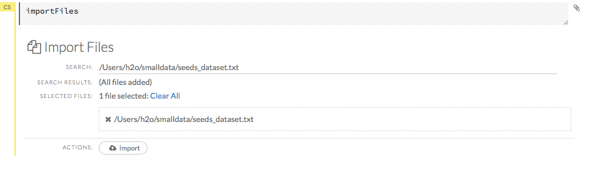
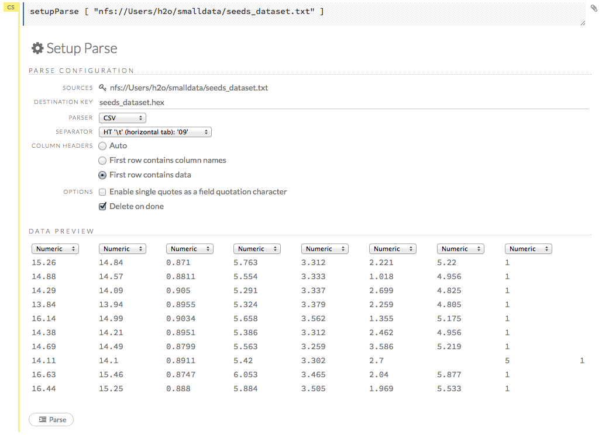
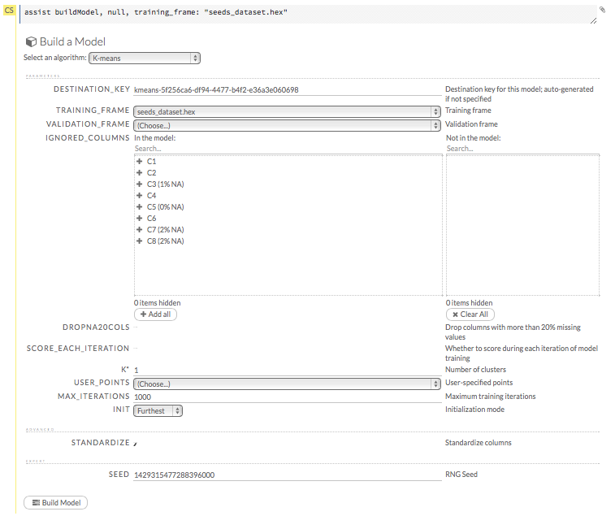

# K Means Tutorial

This tutorial describes how to perform a K-Means analysis. By the end of this tutorial the user should know how to specify, run, and interpret a K-means model in H2O using Flow.

Those who have never used H2O before should refer to <a href="https://github.com/h2oai/h2o-dev/blob/master/h2o-docs/src/product/flow/README.md" target="_blank">Getting Started</a> for additional instructions on how to run H2O Flow.

In the latest version of H2O, the K-means algorithm has a "k-modes" function that allows you to use mixed categorical and real-valued data. By using dissimilarity measures to handle categoricals, replacing cluster means with cluster modes, and using a frequency-based method to update modes in the clustering process to minimize the clustering costs, the k-modes algorithm is scalable in both the number of clusters and the number of records. The k-modes method is used anytime categorical data is present. 

For more information, refer to <a href="http://citeseerx.ist.psu.edu/viewdoc/download?doi=10.1.1.134.83&rep=rep1&type=pdf" target="_blank">"A Fast Clustering Algorithm to Cluster Very Large Categorical Data Sets in Data Mining"</a> and <a href="http://citeseerx.ist.psu.edu/viewdoc/download?doi=10.1.1.15.4028&rep=rep1&type=pdf" target="_blank">"Extensions to the k-Means Algorithm for Clustering Large Data Sets with Catgorical Values"</a> by Zhexue Huang.

### Getting Started

This tutorial uses a publicly available data set that can be found at <a href"http://archive.ics.uci.edu/ml/datasets/seeds" target="_blank">http://archive.ics.uci.edu/ml/datasets/seeds</a>.

The data are composed of 210 observations, 7 attributes, and an a priori grouping assignment. All data are positively valued and continuous. 

If you don't have any data of your own to work with, you can find some example datasets here: 

- <a href="http://docs.h2o.ai/h2oclassic/resources/publicdata.html"  target="_blank">http://docs.h2o.ai/h2oclassic/resources/publicdata.html </a>
- <a href="http://data.h2o.ai" target="_blank">http://data.h2o.ai</a>

####Importing Data
Before creating a model, import data into H2O:

0. Click the **Assist Me!** button (the last button in the row of buttons below the menus). 

 

0. Click the **importFiles** link and enter the file path to the dataset in the **Search** entry field. 
0. Click the **Add all** link to add the file to the import queue, then click the **Import** button. 
  

####Parsing Data
Now, parse the imported data: 

0. Click the **Parse these files...** button. 

   >**Note**: The default options typically do not need to be changed unless the data does not parse correctly. 

0. From the drop-down **Parser** list, select the file type of the data set (Auto, XLS, CSV, or SVMLight). 
0. If the data uses a separator, select it from the drop-down **Separator** list. 
0. If the data uses a column header as the first row, select the **First row contains column names** radio button. If the first row contains data, select the **First row contains data** radio button. You can also select the **Auto** radio button to have H2O automatically determine if the first row of the dataset contains the column names or data. 
0. If the data uses apostrophes ( `'` - also known as single quotes), check the **Enable single quotes as a field quotation character** checkbox. 
0. Review the data in the **Edit Column Names and Types** section, then click the **Parse** button.  

  

  **NOTE**: Make sure the parse is complete by confirming progress is 100% before continuing to the next step, model building. For small datasets, this should only take a few seconds, but larger datasets take longer to parse.

### Building a Model

0. Once data are parsed, click the **View** button, then click the **Build Model** button. 
0. Select `K-means` from the drop-down **Select an algorithm** menu, then click the **Build model** button. 
0. If the parsed arrhythmia.hex file is not already listed in the **Training_frame** drop-down list, select it. Otherwise, continue to the next step. 
0. From the **Ignored_columns** section, select the columns to ignore in the *Available* area to move them to the *Selected* area. For this example, select column 7 (the a priori known clusters for this dataset). 
0. In the **K** field, specify the number of clusters. For this example, enter `3`.  
0. In the **Max_iterations** field, specify the maximum number of iterations. For this example, enter `100`. 
0. From the drop-down **Init** menu, select the initialization mode. For this example, select **PlusPlus**. 
   - Random initialization randomly samples the `k`-specified value of the rows of the training data as cluster centers. 
   - PlusPlus initialization chooses one initial center at random and weights the random selection of subsequent centers so that points furthest from the first center are more likely to be chosen. 
   - Furthest initialization chooses one initial center at random and then chooses the next center to be the point furthest away in terms of Euclidean distance. 
   - User initialization requires the corresponding **User_points** parameter. To define a specific initialization point, select the imported dataset .hex file from the drop-down **User_points** list, then select **User** from the drop-down **Init** list.
   
     **Note**: The user-specified points dataset must have the same number of columns as the training dataset.  

0. Uncheck the **Standardize** checkbox to disable column standardization. 
0. Click the **Build Model** button. 

  

### K-Means Output

K-Means randomly chooses starting points and converges on optimal centroids. The cluster number is arbitrary, and should be thought of as a factor.

The output for K-Means includes the following: 

- Model parameters (hidden)
- A graph of the scoring history (number of iterations vs. average within the cluster's sum of squares) 
- Output (model category, validation metrics if applicable, and centers std)
- Model Summary (number of clusters, number of categorical columns, number of iterations, avg. within sum of squares, avg. sum of squares, avg. between the sum of squares)
- Scoring history (number of iterations, avg. change of standardized centroids, avg. within cluster sum of squares)
- Training metrics (model name, checksum name, frame name, frame checksum name, description if applicable, model category, duration in ms, scoring time, predictions, MSE, avg. within sum of squares, avg. between sum of squares)
- Centroid statistics (centroid number, size, within sum of squares)
- Cluster means (centroid number, column)
- Preview POJO

