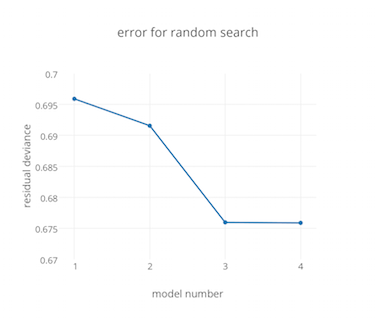
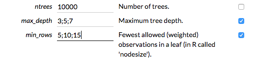
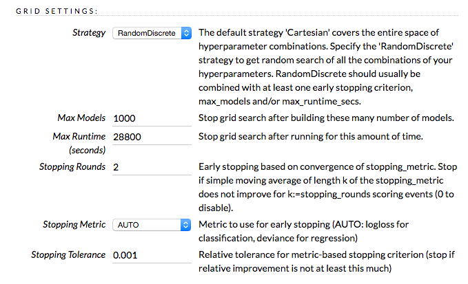

# [Hyperparameter Optimization](https://en.wikipedia.org/wiki/Hyperparameter_optimization) in H2O: Grid Search, Random Search and the Future

>*"Good, better, best. Never let it rest. 'Til your good is better and your better is best." - St. Jerome*

## Overview

H2O now has random [hyperparameter search](https://en.wikipedia.org/wiki/Hyperparameter_optimization) with time- and metric-based early stopping.  Bergstra and Bengio[^1] write on p. 281:

> **Compared with neural networks configured by a pure grid search, we find that random search over the same domain is able to find models that are as good or better within a small fraction of the computation time.**

Even smarter means of searching the hyperparameter space are in the pipeline, but for most use cases random search does as well.

## What Are Hyperparameters?

Nearly all model algorithms used in machine learning have a set of tuning "knobs" which affect how the learning algorithm fits the model to the data.  Examples are the regularization settings *alpha* and *lambda* for [Generalized Linear Modeling](http://h2o-release.s3.amazonaws.com/h2o/rel-turchin/3/docs-website/h2o-docs/booklets/GLM_Vignette.pdf) or *ntrees* and *max_depth* for [Gradient Boosted Models](http://h2o-release.s3.amazonaws.com/h2o/rel-turchin/3/docs-website/h2o-docs/booklets/GBM_Vignette.pdf). These knobs are called *hyperparameters* to distinguish them from internal model parameters, such as GLM's beta coefficients or Deep Learning's weights, which get learned from the data during the model training process.

## What Is Hyperparameter Optimization?

The set of all combinations of values for these knobs is called the *hyperparameter space*.  We'd like to find a set of hyperparameter values which gives us the best model for our data in a reasonable amount of time.  This process is called [hyperparameter optimization](https://en.wikipedia.org/wiki/Hyperparameter_optimization).

H2O contains good default values for many datasets, but to get the best performance for your data you will want to tune at least some of these hyperparameters to maximize the predictive performance of your models. You should start with the most important hyperparameters for your algorithm of choice, for example *ntrees* and *max_depth* for the tree models or the *hidden* layers for Deep Learning.  

H2O provides some guidance by grouping the hyperparameters by their importance in the Flow UI.  You should look carefully at the values of the ones marked *critical*, while the *secondary* or *expert* ones are generally used for special cases or fine tuning.

Note that some hyperparameters, such as *learning_rate*, have a very wide dynamic range.  You should choose  values that reflect this for your search (e.g., powers of 10 or of 2) to ensure that you cover the most relevant parts of the hyperparameter space. (Bergstra and Bengio p. 290)

### Measuring Model Quality

There are many different ways to measure model quality.  If you don't know which to use, H2O will choose a good general-purpose metric for you based on the category of your model ([binomial](https://en.wikipedia.org/wiki/Binary_classification) or [multinomial classification](https://en.wikipedia.org/wiki/Multiclass_classification), [regression](https://en.wikipedia.org/wiki/Regression_analysis), [clustering](https://en.wikipedia.org/wiki/Cluster_analysis), ...).  However, you may want to choose a metric to compare your models based on your specific goals (e.g., [maximizing AUC](https://www.kaggle.com/wiki/AreaUnderCurve), [minimizing log loss](https://www.kaggle.com/wiki/LogarithmicLoss), [minimizing false negatives](https://en.wikipedia.org/wiki/Precision_and_recall), [minimizing mean squared error](https://en.wikipedia.org/wiki/Mean_squared_error), ...).

### Overfitting

[Overfitting](https://en.m.wikipedia.org/wiki/Overfitting) is the phenomenon of fitting a model so thoroughly to your training data that it begins to memorize the fine details of that specific data, rather than finding general characteristics of that data which will also apply to future data on which you want to make predictions.

Overfitting not only applies to the model training process, but also to the *model selection* process.  During the process of tuning the hyperparameters and selecting the best model you should avoid overfitting them to your training data.  Otherwise, the hyperparameter values that you choose will be too highly tuned to your selection data, and will not generalize as well as they could to new data.  Note that this is the same principle as, but subtly different from, overfitting during model training. Ideally you should use [cross-validation](https://en.wikipedia.org/wiki/Cross-validation_(statistics)) or a [validation set](https://en.wikipedia.org/wiki/Test_set#Validation_set) during training and then a final holdout *test* ([validation](https://en.wikipedia.org/wiki/Test_set#Validation_set)) dataset for model selection.  As Bergstra and Bengio write on p. 290, 

> The standard practice for evaluating a model found by cross-validation is to report [test set error] for the [hyperparameter vector] that minimizes [validation error].

You can read much more on this topic in Chapter 7 of [Elements of Statistical Learning](http://statweb.stanford.edu/~tibs/ElemStatLearn/) from H2O advisors and Stanford professors Trevor Hastie and Rob Tibshirani with Jerome Friedman [^2].

## Selecting Hyperparameters Manually and With Cartesian Grid

The traditional method of selecting the values for your hyperparameters has been to individually train a number of models with different combinations of values, and then to compare the model performance to choose the best model.  For example, for a tree-based model you might choose *ntrees* of (50, 100 and 200) and *max_depth* of (5, 10, 15 and 20) for a total of 3 x 4 = 12 models.  This process of trying out hyperparameter sets by hand is called *manual search*.  By looking at the models' predictive performance, as measured by test-set, cross-validation or validation metrics, you select the best hyperparameter settings for your data and needs.  

As the number of hyperparameters and the lists of desired values increase this obviously becomes quite tedious and difficult to manage.

### A Little Help?

For several years H2O has included *grid search*, also known as *Cartesian Hyperparameter Search* or *exhaustive search*.  Grid search builds models for every combination of hyperparameter values that you specify.  

Bergstra and Bengio write on p. 283:

> Grid search ... typically finds a better [set of hyperparameters] than purely manual sequential optimization (in the same amount of time)

H2O keeps track of all the models resulting from the search, and allows you to sort the list based on any supported model metric (e.g., AUC or log loss).  For the example above, H2O would build your 12 models and return the list sorted with the best first, either using the metric of your choice or automatically using one that's generally appropriate for your model's category.

H2O allows you to run multiple hyperparameter searches and to collect all the models for comparison in a single sortable result set: just name your grid and run multiple searches.  You can even add models from manual searches to the result set by specifying a grid search with a single value for each interesting hyperparameter:

```Python
# Begin with a random search of a space of 6 * 5 = 30 possible models:
hyper_parameters = { 'alpha': [0.01,0.1,0.3,0.5,0.7,0.9], 
                     'lambda': [1e-4,1e-5,1e-6,1e-7,1e-8] }

search_criteria = { 'strategy': "RandomDiscrete", 'seed': 42,
                    'stopping_metric': "AUTO", 
                    'stopping_tolerance': 0.001,
                    'stopping_rounds': 2 }
		    
random_plus_manual = 
    H2OGridSearch(H2OGeneralizedLinearEstimator(family='binomial', nfolds=5),
      hyper_parameters, 
      grid_id="random_plus_manual", 
      search_criteria=search_criteria)
    
random_plus_manual.train(x=x,y=y, training_frame=training_data)

# Now add a manual search to the results:
manual_hyper_parameters = {'alpha': [0.05], 'lambda': [1e-4]}
random_plus_manual = 
    H2OGridSearch(H2OGeneralizedLinearEstimator(family='binomial', nfolds=5),
      manual_hyper_parameters, 
      grid_id="random_plus_manual")

random_plus_manual.train(x=x,y=y, training_frame=training_data)

random_plus_manual.show()
print(random_plus_manual.sort_by('F1', False))
```


## Searching Large Hyperparameter Spaces

As the number of hyperparameters being tuned increases, and the values that you would like to explore for those hyperparameters increases, you obviously get a combinatorial explosion in the number of models required for an exhaustive search.  Since we always have time constraints on the model tuning process the obvious thing to do is to narrow down our choices by doing a coarser search of the space. Given a fixed amount of time, making random choices of hyperparameter values generally gives results that are better than the best results of an Cartesian (exhaustive) search.  

Bergstra and Bengio write on p. 281:

> **Compared with neural networks configured by a pure grid search,
we find that random search over the same domain is able to find models that are as good or better within a small fraction of the computation time.** Granting random search the same computational budget, random search finds better models by effectively searching a larger, less promising configuration
space.

> ...

> **[F]or most data sets only a few of the hyper-parameters really matter,
but ... different hyper-parameters are important on different data sets. This phenomenon makes grid search a poor choice for configuring algorithms for new data sets.**

> ...

> We propose random search as a substitute and baseline that is both reasonably efficient (roughly equivalent to or better than combinining manual search and grid search, in our experiments) and keeping the advantages of implementation simplicity and reproducibility of pure grid search.

> ...

> [R]andom search ... trades a small reduction in efficiency in low-dimensional spaces for a large improvement in efficiency in high-dimensional search spaces.

After doing a random search, if desired you can then iterate by "zooming in" on the regions of the hyperparameter space which look promising.  You can do this by running additional, more targeted, random or Cartesian hyperparameter searches or manual searches.  For example, if you started with *alpha* values of [0.0, 0.25, 0.5, 0.75, 1.0] and the middle values look promising, you can follow up with a finer grid of [0.3, 0.4, 0.5, 0.6, 0.7].


## Random Hyperparameter Search in H2O

H2O has supported random hyperparameter search since version 3.8.1.1.  To use it, specify a grid search as you would with a Cartesian search, but add *search criteria* parameters to control the type and extent of the search.  You can specify a max runtime for the grid, a max number of models to build, or metric-based automatic early stopping.  If you choose several of these then H2O will stop when the first of the criteria are met.  As an example, you might specify "stop when MSE has improved over the moving average of the best 5 models by less than 0.0001, but take no more than 12 hours".

H2O will choose a random set of hyperparameter values from the ones that you specify, without repeats, and build the models sequentially.  You can look at the incremental results while the models are being built by fetching the grid with the `h2o.getGrid` (R) or `h2o.get_grid` (Python) functions.  There's also a `getGrids` command in Flow that will allow you to click on any of the grids you've built.  H2O's Flow UI will soon plot the error metric as the grid is being built to make the progress easy to visualize, something like this:



### Choosing Search Criteria

In general, metric-based early stopping optionally combined with max runtime is the best choice.  The number of models it will take to converge toward a global best can vary a lot (see below), and metric-based early stopping accounts for this automatically by stopping the search process when the error curve ([learning curve](http://youtu.be/g4XluwGYPaA)[^3]) flattens out.

The number of models required for convergence depends on a number of things, but mostly on the "shape" of the error function in the hyperparameter space [Bergstra and Bengio p. 291].  While most algorithms perform well in a fairly large region of the hyperparameter space on most datasets, some combinations of dataset and algorithm are very sensitive: they have a very "peaked" error functions.  In tuning neural networks with a large numbers of hyperparameters and various datasets Bergstra and Bengio find convergence within 2-64 trials (models built), depending largely on which hyperparameters they choose to tune.  In some classes of search they reach convergence in 4-8 trials, even with a very large search space:

> Random experiment efficiency curves of a single-layer neural network for eight of the data sets used in Larochelle et al. (2007) ... (7 hyper-parameters to optimize). ... Random searches of 8 trials match or outperform grid searches of (on average) 100 trials.

Simpler algorithms such as GBM and GLM should require few trials to get close to a global minimum.

### Examples: R

This example is clipped from [GridSearch.md](https://github.com/h2oai/h2o-3/blob/master/h2o-docs/src/product/tutorials/GridSearch.md):

```r

# Construct a large Cartesian hyper-parameter space
ntrees_opts = c(10000)       # early stopping will stop earlier
max_depth_opts = seq(1,20)
min_rows_opts = c(1,5,10,20,50,100)
learn_rate_opts = seq(0.001,0.01,0.001)
sample_rate_opts = seq(0.3,1,0.05)
col_sample_rate_opts = seq(0.3,1,0.05)
col_sample_rate_per_tree_opts = seq(0.3,1,0.05)
#nbins_cats_opts = seq(100,10000,100) # no categorical features
                                      # in this dataset

hyper_params = list( ntrees = ntrees_opts, 
                     max_depth = max_depth_opts, 
                     min_rows = min_rows_opts, 
                     learn_rate = learn_rate_opts,
                     sample_rate = sample_rate_opts,
                     col_sample_rate = col_sample_rate_opts,
                     col_sample_rate_per_tree = col_sample_rate_per_tree_opts
                     #,nbins_cats = nbins_cats_opts
)


# Search a random subset of these hyper-parmameters. Max runtime 
# and max models are enforced, and the search will stop after we 
# don't improve much over the best 5 random models.
search_criteria = list(strategy = "RandomDiscrete", 
                       max_runtime_secs = 600, 
                       max_models = 100, 
                       stopping_metric = "AUTO", 
                       stopping_tolerance = 0.00001, 
                       stopping_rounds = 5, 
                       seed = 123456)

gbm_grid <- h2o.grid("gbm", 
                     grid_id = "mygrid",
                     x = predictors, 
                     y = response, 

                     # faster to use a 80/20 split
                     training_frame = trainSplit,
                     validation_frame = validSplit,
                     nfolds = 0,

                     # alternatively, use N-fold cross-validation:
                     # training_frame = train,
                     # nfolds = 5,

                     # Gaussian is best for MSE loss, but can try 
                     # other distributions ("laplace", "quantile"):
                     distribution="gaussian",

                     # stop as soon as mse doesn't improve by 
                     # more than 0.1% on the validation set, 
                     # for 2 consecutive scoring events:
                     stopping_rounds = 2,
                     stopping_tolerance = 1e-3,
                     stopping_metric = "MSE",

                     # how often to score (affects early stopping):
                     score_tree_interval = 100, 
                     
                     ## seed to control the sampling of the 
                     ## Cartesian hyper-parameter space:
                     seed = 123456,
                     hyper_params = hyper_params,
                     search_criteria = search_criteria)

gbm_sorted_grid <- h2o.getGrid(grid_id = "mygrid", sort_by = "mse")
print(gbm_sorted_grid)

best_model <- h2o.getModel(gbm_sorted_grid@model_ids[[1]])
summary(best_model)
```

You can find [another example here](https://github.com/h2oai/h2o-tutorials/blob/master/h2o-open-tour-2016/chicago/grid-search-model-selection.R).

### Examples: Python

This example is clipped from  [pyunit\_benign\_glm\_grid.py](https://github.com/h2oai/h2o-3/blob/master/h2o-py/tests/testdir_algos/glm/pyunit_benign_glm_grid.py):

```python
hyper_parameters = {'alpha': [0.01,0.3,0.5], 'lambda': [1e-5,1e-6,1e-7,1e-8]}

# test search_criteria plumbing and max_models
search_criteria = { 'strategy': "RandomDiscrete", 'max_models': 3 }
max_models_g = H2OGridSearch(H2OGeneralizedLinearEstimator(family='binomial'),
                             hyper_parameters, search_criteria=search_criteria)
max_models_g.train(x=x,y=y, training_frame=training_data)

max_models_g.show()
print(max_models_g.grid_id)
print(max_models_g.sort_by('F1', False))

assert len(max_models_g.models) == 3, "expected 3 models, got: {}".format(len(max_models_g.models))
print(max_models_g.sorted_metric_table())
print(max_models_g.get_grid("r2"))

# test search_criteria plumbing and asymptotic stopping
search_criteria = { 'strategy': "RandomDiscrete", 'seed': 42,
		    'stopping_metric': "AUTO", 'stopping_tolerance': 0.1,
		    'stopping_rounds': 2 }
asymp_g = H2OGridSearch(H2OGeneralizedLinearEstimator(family='binomial', nfolds=5),
	                hyper_parameters, search_criteria=search_criteria)
asymp_g.train(x=x,y=y, training_frame=training_data)

asymp_g.show()
print(asymp_g.grid_id)
print(asymp_g.sort_by('F1', False))

assert len(asymp_g.models) == 5, "expected 5 models, got: {}".format(len(asymp_g.models))
```


### Examples: Flow

Flow includes an example called GBM_GridSearch.flow which does both Cartesian and random searches:






## What's That Up In The Road? A Head? (Roadmap)

This section covers possible improvements for hyperparameter search in H2O and lays out a roadmap.

### Ease of Use

With the addition of random hyperparameter search it becomes more practical for non-experts to get good, albeit not expert, results with the ML model training process:

> Algorithmic approaches to hyper-parameter optimization make machine learning results easier to disseminate, reproduce, and transfer to other domains.[^4] p. 8

We are looking into adding either fixed or heuristically-driven hyperparameter spaces for use with random search, essentially an "I'm Feeling Lucky" button for model building.


### Covering the Space Better

One possibility for improving random search is choosing sets of hyperparameters which cover the space more efficiently than randomly choosing each value independently.  Bergstra and Bengio cover this on pages 295-297, and find a potential improvement of only a few percentage points and only when doing searches of 100-500 models.  This is because, as they state earlier, the number of hyperparameters which are important for a given dataset is quite small (1-4), and the random search process covers this low number of dimensions quite well.  See the illustration of the projection of high hyperparameter space dimensions onto low on Bergstra and Bengio p. 284 and the plots of hyperparameter importance by dataset on p. 294.  On p. 295 they show that the speed of convergence of the search is directly related to the number of hyperparameters which are important for the given dataset.

There is ongoing research on trying to predetermine the "variable importance" of hyperparameters for a given dataset.  If this bears fruit we will be able to narrow the search so that we converge to a globally-good model more quickly.


### Learning the Hyperparameter Space

Bergstra and Bengio and Bergstra, Bengio, Bardenet and Kegl note that random hyperparameter search works almost as well as more sophisticated methods for the types of algorithms available in H2O.   For very complex algorithms like Deep Belief Networks (not available in H2O) they can be insufficient:

> Random search has been shown to be sufficiently efficient for learning neural networks for several datasets, but we show it is unreliable for training DBNs.

> ...

> 1) Random search is competitive with the manual optimization of DBNs ... and 2) Automatic sequential optimization outperforms both manual and random search.

*Automatic sequential optimization* refers here to techniques which build a model of the hyperparameter space and use it to guide the search process.  The most well-known of these is the use of Gaussian Process (GP) models.  Bergstra, Bengio, Bardenet and Kegl compare  random search against both Gaussian Process  and Tree-structured Parzen Estimator (TPE) learning techniques.  They train Deep Belief Networks of 10 hyperparameters on a very tiny dataset of 506 rows and 13 columns. [Bergstra, Bengio, Bardenet and Kegl p. 5], initializing the GP and TPE models with the results of a 30-model random search.

They find that for this test case the TPE method outperforms GP and GP outperforms random search beyond the initial 30 models.  However, they can't explain whether TPE does better because it narrows in on good hyperparameters more quickly or conversely because it searches more randomly than GP. [Bergstra, Bengio, Bardenet and Kegl p. 7]  Also note that the size of the dataset is very, very small compared with the number of internal model parameters and model tuning hyperparameters.  It is a bit hard to believe that these results apply to datasets of typical sizes for users of H2O (hundreds of millions or billions of rows, and hundreds or thousands of columns).

Experimentation and prototyping is clearly needed here to see which of these techniques, if any, are worth adding to H2O.


[^1]: Bergstra and Bengio. [*Random Search for Hyper-Parameter Optimization*, 2012](http://www.jmlr.org/papers/volume13/bergstra12a/bergstra12a.pdf)

[^2]: Trevor Hastie, Rob Tibshirani and Jerome Friedman. [*The Elements of Statistical Learning*, 2008](http://statweb.stanford.edu/~tibs/ElemStatLearn/)

[^3]: Andrew Ng. [*Machine Learning*, 2016](https://class.coursera.org/ml-005/)

[^4]: Bergstra, Bengio, Bardenet and Kegl. [*Algorithms for Hyper-parameter Optimization*, 2011](https://papers.nips.cc/paper/4443-algorithms-for-hyper-parameter-optimization.pdf)


