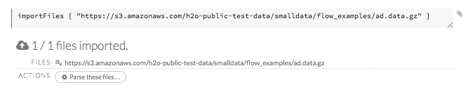
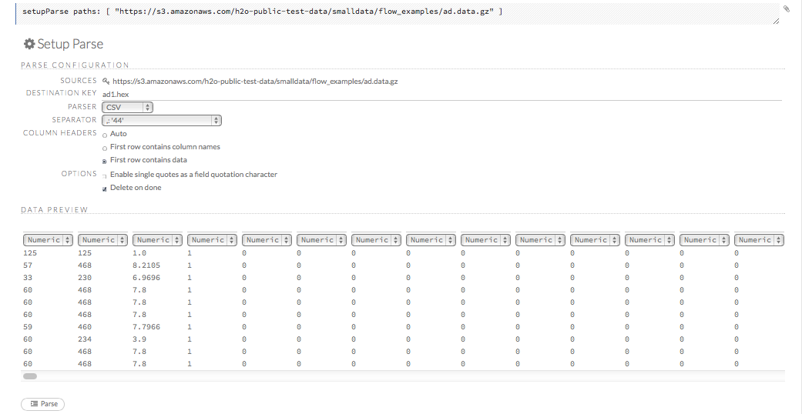
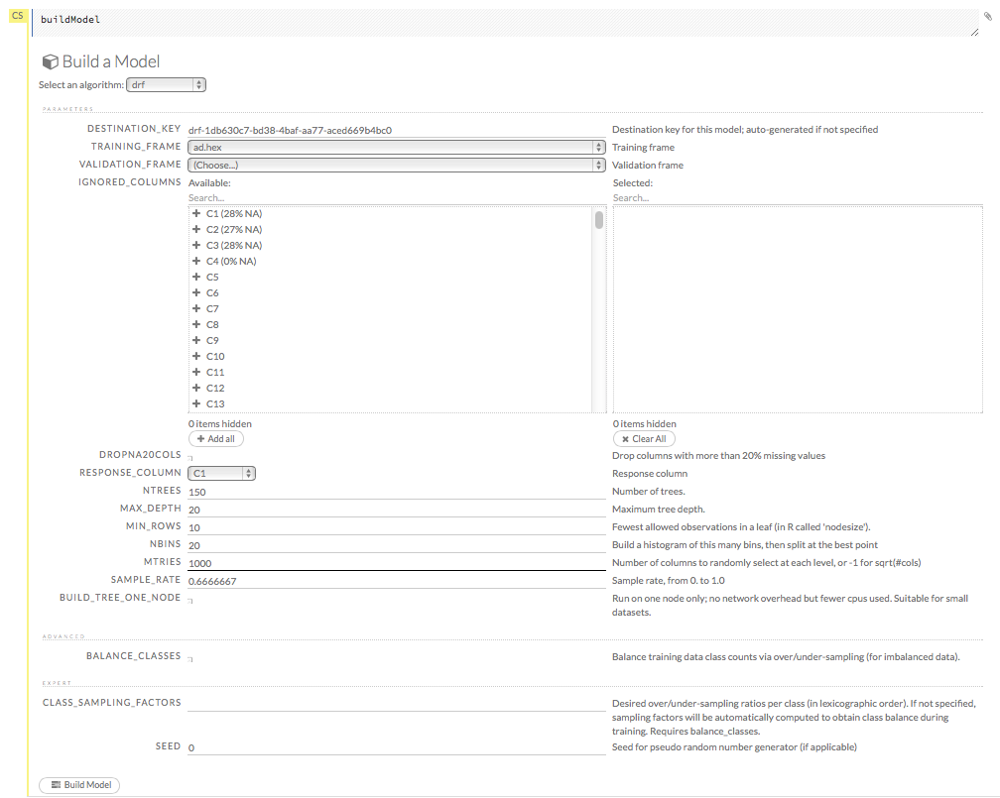
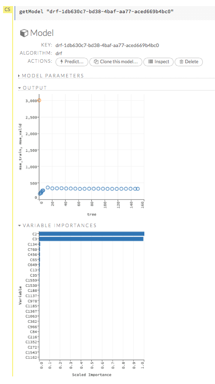
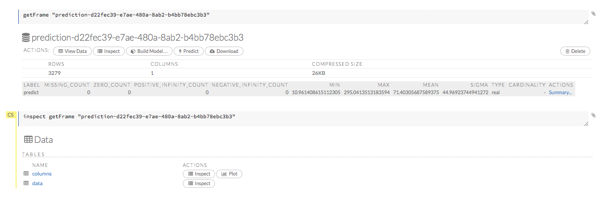

## Distributed Random Forest Tutorial

This tutorial describes how to create a Distributed Random Forest (DRF) model using H2O Flow.

Those who have never used H2O before should refer to <a href="https://github.com/h2oai/h2o-dev/blob/master/h2o-docs/src/product/flow/README.md" target="_blank">Getting Started</a> for additional instructions on how to run H2O Flow.

### Getting Started

This tutorial uses a publicly available data set that can be found at <a href ="http://archive.ics.uci.edu/ml/machine-learning-databases/internet_ads/" target="_blank">http://archive.ics.uci.edu/ml/machine-learning-databases/internet_ads/</a>

The data are composed of 3279 observations, 1557 attributes, and an a priori grouping assignment. The objective is to build a prediction tool that predicts whether an object is an internet ad or not.

If you don't have any data of your own to work with, you can find some example datasets here: 

- <a href="http://docs.h2o.ai/h2oclassic/resources/publicdata.html"  target="_blank">http://docs.h2o.ai/h2oclassic/resources/publicdata.html </a>
- <a href="http://data.h2o.ai" target="_blank">http://data.h2o.ai</a>

####Importing Data
Before creating a model, import data into H2O:

0. Click the **Assist Me!** button (the last button in the row of buttons below the menus). 

 

0. Click the **importFiles** link and enter the file path to the dataset in the **Search** entry field.  
0. Click the **Add all** link to add the file to the import queue, then click the **Import** button. 

  

####Parsing Data
Now, parse the imported data: 

0. Click the **Parse these files...** button. 

  **Note**: The default options typically do not need to be changed unless the data does not parse correctly. 

0. From the drop-down **Parser** list, select the file type of the data set (Auto, XLS, CSV, or SVMLight). 
0. If the data uses a separator, select it from the drop-down **Separator** list. 
0. If the data uses a column header as the first row, select the **First row contains column names** radio button. If the first row contains data, select the **First row contains data** radio button. To have H2O automatically determine if the first row of the dataset contains column names or data, select the **Auto** radio button. 
0. If the data uses apostrophes ( `'` - also known as single quotes), check the **Enable single quotes as a field quotation character** checkbox. 
0. To delete the imported dataset after parsing, check the **Delete on done** checkbox. 

  **NOTE**: In general, we recommend enabling this option. Retaining data requires memory resources, but does not aid in modeling because unparsed data cannot be used by H2O.

0. Review the data in the **Edit Column Names and Types** section, then click the **Parse** button.  

  

  **NOTE**: Make sure the parse is complete by confirming progress is 100% before continuing to the next step, model building. For small datasets, this should only take a few seconds, but larger datasets take longer to parse.

### Building a Model

0. Once data are parsed, click the **View** button, then click the **Build Model** button. 
0. Select `Distributed RF` from the drop-down **Select an algorithm** menu, then click the **Build model** button. 
0. If the parsed ad.hex file is not already listed in the **Training_frame** drop-down list, select it. Otherwise, continue to the next step. 
0. From the **Response column** drop-down list, select `C1`. 
0. In the **Ntrees** field, specify the number of trees for the model to build. For this example, enter `150`. 
0. In the **Max_depth** field, specify the maximum distance from the root to the terminal node. For this example, use the default value of `20`. 
0. In the **Mtries** field, specify the number of features on which the trees will be split. For this example, enter `1000`. 
0. Click the **Build Model** button. 

   

### DRF Output

The DRF model output includes the following: 

- Model parameters (hidden)
- Scoring history graph (number for each tree and MSE)
- ROC curve, training metrics, AUC (with drop-down menus to select thresholds and criterion) 
- Variable importances (variable name, relative importance, scaled importance, percentage)
- Output (model category, validation metrics, initf)
- Model summary (number of trees, min. depth, max. depth, mean depth, min. leaves, max. leaves, mean leaves)
- Scoring history (in tabular format)
- Training metrics (model name, model checksum, frame name, frame checksum, description if applicable, model category, duration in ms, scoring time, predictions, MSE, R2, Logloss, AUC, Gini)
- Domain 
- Training metrics (thresholds, F1, F2, F0Points, Accuracy, Precision, Recall, Specificity, Absolute MCC, min. per-class accuracy, TNS, FNS, FPS, TPS, IDX)
- Maximum metrics (metric, threshold, value, IDX)
- Variable importances
- Preview POJO

  

### DRF Predict

To generate a prediction, click the **Predict** button in the model results and select the `ad.hex` file from the drop-down **Frame** list, then click the **Predict** button. 

  

You can also click the **Inspect** button to access more information (for example, columns or data). 

  

