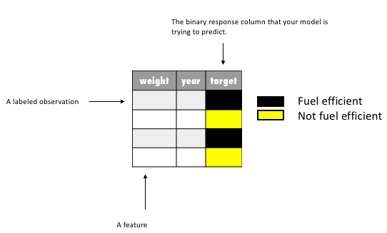
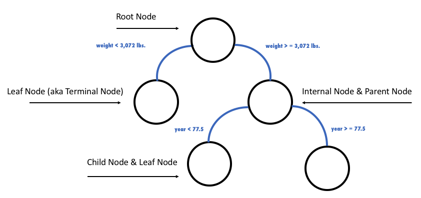
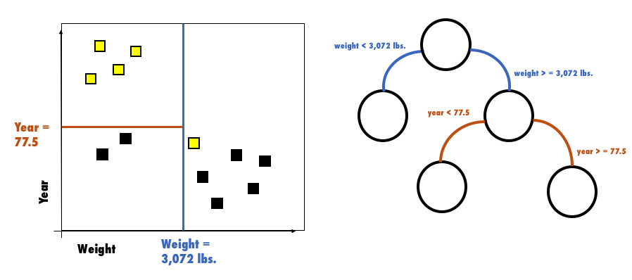
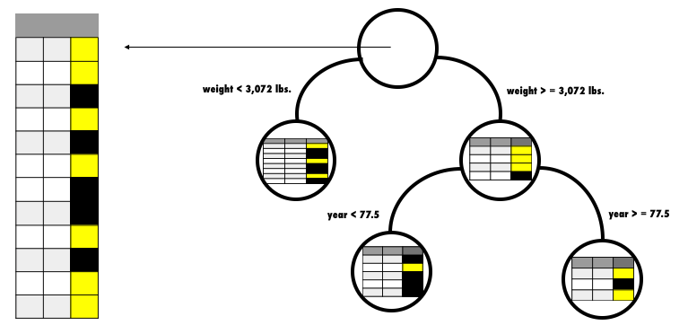
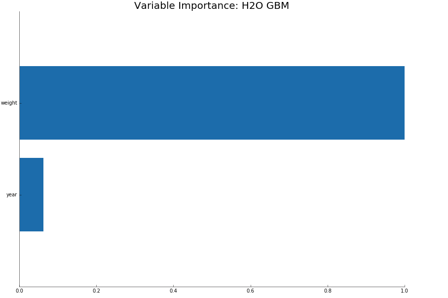
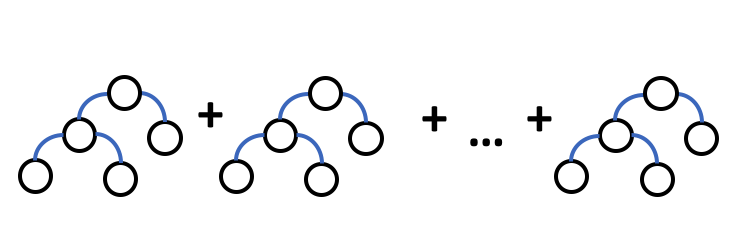
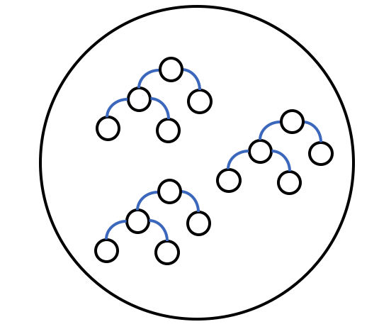

.. _variable-importance:

Variable Importance
===================

This section describes how variable importance is calculated for tree-based models. For examples, this section uses the cars dataset to classify whether or not a car is fuel efficient based on its weight and the year it was built. 

The first part of this section depicts terminology for a training dataset, decision tree, tree-based ensembles, and the tree building process (i.e. building regression trees). The last part of this section explains how variable importance is calculated. 

Training Data Terminology
-------------------------

Training data is composed of observations and corresponding target labels - fuel efficient, not fuel efficient. In this example, you can think of each observation as a specific car, where each characteristic collected on that car (i.e. weight and year) is called a feature. 

Decision Tree Terminology
-------------------------

A decision tree is an algorithm that recursively divides your training data, based on certain splitting criteria, to predict a given target (aka response column). You can use the following image to understand the naming conventions for a decision tree and the types of division a decision tree makes. For the cars dataset, for example, this decision tree starts with all the cars in the root node, then divides these cars into those with  weight less than 3,072 lbs and those with weight greater than or equal to 3,072 lbs; for all cars greater than 3,072 lbs an additional separation is made between cars with a model year less than 77.5 (i.e. made after June 1977) and cars with a model year greater than or equal to 77.5. 

Decision Tree Representations
-----------------------------

The decision tree represents the process of recursively dividing the feature space with orthogonal splits. In the following image, each node (right-hand side) corresponds to a subset of the car's observations in their feature space (left-hand side). The first orthogonal split is the blue line and it corresponds to the decision tree's root node split. The brown line is the second split, which further divides the feature space within the region where weight >= 3,072 lbs.  

Building a Decision Tree
------------------------

The Different Types of Decision Trees
~~~~~~~~~~~~~~~~~~~~~~~~~~~~~~~~~~~~~

There are two types of decision trees: classification and regression. Classification trees predict a class through a voting system where the majority class within a leaf node wins; regression trees predicts a numeric value calculated based on the target's distribution within a node. In addition to regression problems, regression trees can also be used to solve classification problems. 

H2O, in fact, only uses regression trees for all classes of problems (i.e. binary, multi-class, or regression). For binary or multi-class classification H2O applies the one-versus-all approach. 

Why a Decision Tree Stops Growing
~~~~~~~~~~~~~~~~~~~~~~~~~~~~~~~~~

A user must specify a set of stopping criteria for which the tree will stop growing. These stopping criteria include: a specific depth (i.e., this tree can only have 3 levels), a minimum number of observations per node (i.e., there must be at least 6 observations for this node to split again), and a loss metric for which each split should generate a minimum improvement (i.e., a new split must cause the AUC to improve by at least .01). 

Splitting Based on Squared Error
--------------------------------

A split decision is made with respect to an impurity measurement. In H2O, since we are building distributed regression trees, we pick the "best" split point - a feature at a given value - based on the squared error.  

The decision of which feature to split on is based on which feature reduces a node's squared error the most. The above image shows that splitting the 12 car-dataset observations, at the root node on the weights feature, reduces the squared error the most. Then dividing those observations that have a `weight` greater than or equal to 3,072 lbs, by year < or >= to 77.5 provides the next greatest squared error improvement. The reason this decision tree does not continue to grow is because its maximum depth was limited to two and its minimum number of row observations to split on, was limited to six. (This is also why the left-most node does not contain another split decision.)

Feature Importance (aka Variable Importance) Plots
--------------------------------------------------

The following image shows variable importance for a GBM, but the calculation would be the same for Distributed Random Forest. While it is possible to get the raw variable importance for each feature, H2O displays each feature's importance after it has been scaled between 0 and 1.

Variable Importance Calculation (GBM & DRF)
-------------------------------------------

Variable importance is determined by calculating the relative influence of each variable: whether that variable was selected to split on during the tree building process, and how much the squared error (over all trees) improved (decreased) as a result. 

Whenever H2O splits a node, based on a numeric or categorical feature, the feature's attributed reduction in squared error is the difference in squared error between that node and its children nodes. The squared error for each individual node is the reduction in variance of the response value within that node. (The calculation assumes an unbiased estimator, i.e., :math:`SE=MSE*N=VAR*N`): 

Variance Equation: 

.. math::

    VAR=\frac{1}{N}\sum_{i=0}^{N}(y_{i}-\bar{y})^2

Squared Error Equation: 

.. math::

    SE = VAR \times{N} =\left[\frac{1}{N} \times  \sum_{i=0}^{N}y_{i}^2 -N\times{\bar{y}^2} \right] \times N  = \left[ \sum_{i=0}^{N}\frac{y_{i}^2}{N} - \bar{y}^2 \right ]\times N

**Note**: For the sake of simplicity, we have omitted weights in the equations above. In reality, H2O includes weights in its calculation of squared error.

Tree-Based Algorithms
---------------------

So far we've visualized how a single decision tree works. Next, we visualize tree-based ensemble methods. 

GBM
~~~

The Gradient Boosted Machine is a model that sequentially trains decision trees. Each decision tree is built on the errors of the previous tree. (The first tree is built on the errors of an initialized prediction - based on the distribution of the response column - and the actual response value of each observation.)

DRF
~~~

Distributed Random Forest is a model that trains many decision trees in parallel and then averages their results.

XGBoost
~~~~~~~

The variable importances are computed from the gains of their respective loss functions during tree construction. H2O uses squared error, and XGBoost uses a more complicated one based on gradient and hessian.

Non-Tree-Based Algorithms
-------------------------

We'll now examine how non-tree-based algorithms calculate variable importance.

Deep Learning
~~~~~~~~~~~~~
Variable importance is calculated using the `Gedeon method <http://users.cecs.anu.edu.au/~Tom.Gedeon/pdfs/ContribDataMinv2.pdf>`__.

GLM/GAM
~~~~~~~

Variable importance represents the coefficient magnitudes. The standardized coefficients are returned if the ``standardize`` option is enabled (which is the default). These are the predictor weights of the standardized data and are included only for informational purposes like comparing the relative variable importance.

References
----------

Rifkin, Ryan and Klautau, Aldebaro. "In Defense of One-Vs-All Classification." J. Mach. Learn. Res. (2004):101-141. (http://www.jmlr.org/papers/v5/rifkin04a.html)

