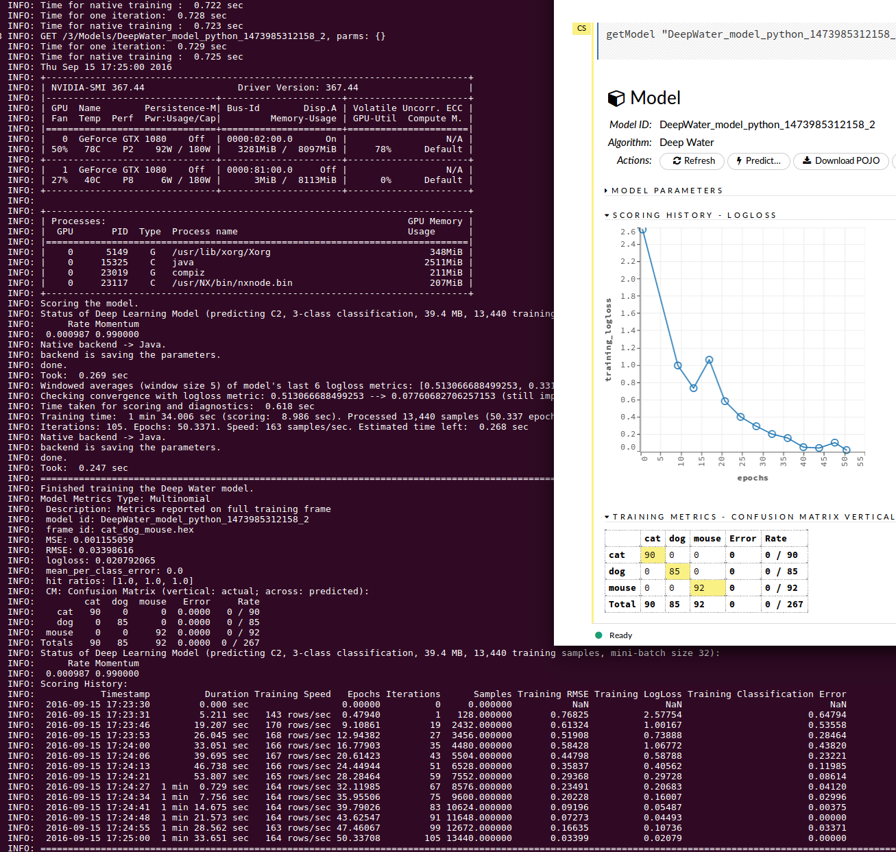

# Deep Water Python Tests

### To run these examples:
* Obtain or build your own H2O python wheel from the [Deep Water repository](https://github.com/h2oai/deepwater/tree/master)
* Download dataset (https://h2o-public-test-data.s3.amazonaws.com/bigdata/laptop/deepwater/imagenet/cat_dog_mouse.tgz, unpack contents into directory ./bigdata/laptop/deepwater/imagenet/<here>, relative to where h2o was launched)
* Run python tests with `python ./pyunit_lenet_deepwater.py`

### Example: Inception model (152-layers)

