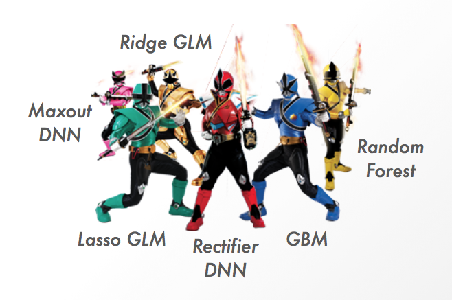

# H2O Ensemble

The **h2oEnsemble** R package provides functionality to create ensembles from the base learning algorithms that are accessible via the **h2o** R package (H2O version 3.0 and above).  This type of ensemble learning is called "super learning", "stacked regression" or "stacking."  The Super Learner algorithm learns the optimal combination of the base learner fits. In a 2007 article titled, "[Super Learner](http://dx.doi.org/10.2202/1544-6115.1309)," it was shown that the super learner ensemble represents an asymptotically optimal system for learning.



H2O Ensemble currently supports [regression](https://en.wikipedia.org/wiki/Regression_analysis) and [binary classification](https://en.wikipedia.org/wiki/Binary_classification).  As is true of all the H2O algorithms, binary classification provides predicted values for each class in addition to a predicted class label.  Support for [multiclass classification](https://en.wikipedia.org/wiki/Multiclass_classification) will be included in a future release (follow the progress [here](https://0xdata.atlassian.net/browse/PUBDEV-2355)).

## Tutorial
The [H2O Ensemble Tutorial](http://learn.h2o.ai/content/tutorials/ensembles-stacking/index.html) from [H2O World 2015](http://h2oworld.h2o.ai/) and accompanying [slides](https://github.com/h2oai/h2o-world-2015-training/blob/master/tutorials/ensembles-stacking/H2O_World_2015_Ensembles.pdf) are good places to learn about the algorithm and our implementation.

## Installation

### Prerequisites

The **h2oEnsemble** R package requires the **h2o** R package (and its dependencies) to run.  We always recommend the latest stable version, which you can find on the [H2O R Downloads page](http://www.h2o.ai/download/h2o/r).


### Install H2O Ensemble (Stable)
The latest stable version, compatible with the H2O "Turchin" release, be installed as follows:

```r
install.packages("https://h2o-release.s3.amazonaws.com/h2o-ensemble/R/h2oEnsemble_0.1.8.tar.gz", repos = NULL)
``` 

To install **h2oEnsemble** for a previous stable release of H2O, you can replace the URL above with the URL in the table below that matches your H2O version.

|H2O Stable Release| Recommended version| Other versions |
|:---------|:----------|:----------|
|H2O 3.8.2.1 - [3.8.2.6](http://h2o-release.s3.amazonaws.com/h2o/rel-turchin/6/index.html) (Turchin)|[h2oEnsemble 0.1.8](https://h2o-release.s3.amazonaws.com/h2o-ensemble/R/h2oEnsemble_0.1.8.tar.gz)| [h2oEnsemble 0.1.7](https://h2o-release.s3.amazonaws.com/h2o-ensemble/R/h2oEnsemble_0.1.7.tar.gz), [h2oEnsemble 0.1.6](https://h2o-release.s3.amazonaws.com/h2o-ensemble/R/h2oEnsemble_0.1.6.tar.gz)|
|H2O 3.8.1.1 - [3.8.1.4](http://h2o-release.s3.amazonaws.com/h2o/rel-turan/4/index.html) (Turan)|[h2oEnsemble 0.1.8](https://h2o-release.s3.amazonaws.com/h2o-ensemble/R/h2oEnsemble_0.1.8.tar.gz)| [h2oEnsemble 0.1.7](https://h2o-release.s3.amazonaws.com/h2o-ensemble/R/h2oEnsemble_0.1.7.tar.gz), [h2oEnsemble 0.1.6](https://h2o-release.s3.amazonaws.com/h2o-ensemble/R/h2oEnsemble_0.1.6.tar.gz)|
|H2O 3.8.8.1 - [3.8.0.6](http://h2o-release.s3.amazonaws.com/h2o/rel-tukey/6/index.html) (Tukey)|[h2oEnsemble 0.1.8](https://h2o-release.s3.amazonaws.com/h2o-ensemble/R/h2oEnsemble_0.1.8.tar.gz)| [h2oEnsemble 0.1.7](https://h2o-release.s3.amazonaws.com/h2o-ensemble/R/h2oEnsemble_0.1.7.tar.gz), [h2oEnsemble 0.1.6](https://h2o-release.s3.amazonaws.com/h2o-ensemble/R/h2oEnsemble_0.1.6.tar.gz)|
|H2O 3.6.0.1 - [3.6.0.8](http://h2o-release.s3.amazonaws.com/h2o/rel-tibshirani/8/index.html) (Tibshirani)|[h2oEnsemble 0.1.5](https://h2o-release.s3.amazonaws.com/h2o-ensemble/R/h2oEnsemble_0.1.5.tar.gz)||
|H2O 3.2.0.1 - [3.2.0.9](http://h2o-release.s3.amazonaws.com/h2o/rel-slater/9/index.html) (Slater)|[h2oEnsemble 0.1.4](https://h2o-release.s3.amazonaws.com/h2o-ensemble/R/h2oEnsemble_0.1.4.tar.gz)||

### Install Development Version
The following are two ways that you can install the development version of the **h2oEnsemble** package. 

- Install directly from GitHub in R using `devtools::install_github`:

```r
library(devtools)
install_github("h2oai/h2o-3/h2o-r/ensemble/h2oEnsemble-package")
```

- Clone the main h2o-3 repository and install the package:

```bash
git clone https://github.com/h2oai/h2o-3.git
R CMD INSTALL h2o-3/h2o-r/ensemble/h2oEnsemble-package
```


## Create Ensembles
- An example of how to train and test an ensemble is in the `h2o.ensemble` function documentation in the `h2oEnsemble` package and also in the [H2O Ensemble Tutorial](http://learn.h2o.ai/content/tutorials/ensembles-stacking/index.html).
- The ensemble is defined by its set of base learning algorithms and the metalearning algorithm.  Algorithm wrapper functions are used to specify these algorithms.
- The ensemble fit is an object of class, "h2o.ensemble", however this is just an R list.
- Also available since v. 0.1.8 is the `h2o.stack` function, which can take existing H2O models as a list and fit the metalearning function.  This function also returns an object of class, "h2o.ensemble".


## Wrapper Functions
- The ensemble works by using wrapper functions (located in the `wrappers.R` file in the package).  These wrapper functions are used to specify the base learner and metalearner algorithms for the ensemble.  Examples of how to create custom algorithm wrappers are available in the [H2O Ensemble Tutorial](http://learn.h2o.ai/content/tutorials/ensembles-stacking/index.html).
- This methodology of using wrapper functions is modeled after the [SuperLearner](http://cran.r-project.org/web/packages/SuperLearner/index.html) and [subsemble](http://cran.r-project.org/web/packages/subsemble/index.html) ensemble learning packages.  The use of wrapper functions makes the ensemble code cleaner by providing a unified interface.
- Often it is a good idea to include variants of one algorithm/function by specifying different tuning parameters for different base learners.  There is an examples of how to create new variants of the wrapper functions in the [create\_h2o\_wrappers.R](https://github.com/h2oai/h2o-3/blob/master/h2o-r/ensemble/create_h2o_wrappers.R) script, as well as in the `h2o.ensemble` R function documentation.
- The wrapper functions must have unique names.
- The more diverse the base learner library, the better!


## Metalearning
- Historically, methods such as GLM or [non-negative least squares (NNLS)](https://en.wikipedia.org/wiki/Non-negative_least_squares) have been used to find the optimal weighted combination of the base learners, however any supervised learning algorithm can be used as a metalearner.  To use a GLM with non-negative weights, you simply pass `non_negative = TRUE` to the generic, `h2o.glm.wrapper` function as follows:

```r
h2o.glm_nn <- function(..., non_negative = TRUE) {
  h2o.glm.wrapper(..., non_negative = non_negative)
}
metalearner <- "h2o.glm_nn"
```
- We allow the user to specify any H2O-supported algorithm as a metalearner, however, since the features in the metalearning step are highly correlated, we recommend using a metalearner such as a regularized GLM or Deep Neural Net.  (e.g. `h2o.glm.wrapper`, which is the default, or `h2o.deeplearning.wrapper`).
- Since the metalearning step is relatively quick compared to the base learning tasks, we recommend using the `h2o.metalearn` function to re-train the ensemble fit using different metalearning algorithms.
- At this time, we still support using SuperLearner-based functions for metalearners, although, for performance reasons, it is not recommended.  For example, you can use the `SL.glm` (included in the [SuperLearner](http://cran.r-project.org/web/packages/SuperLearner/index.html) R package).  When using a SuperLearner-based function for a metalearner, an `N x L` matrix will be pulled into R memory from H2O (`n` is number of observations and `L` is the number of base learners).  This may cause the code to fail for training sets of greater than ~8M rows due to a memory allocation issue.  Support for SuperLearner-based metalearners will be deprecated in the future.


## Saving Ensembles

Check out the `h2o.save_ensemble` and `h2o.load_ensemble` functions to save and load your ensemble models.  An "ensemble model" is the collection of the base learners, metalearners and an `.RData` file containing metadata about ensemble.


## Known Issues
- This package is incompatible with R 3.0.0-3.1.0 due to a [parser bug](https://bugs.r-project.org/bugzilla3/show_bug.cgi?id=15753) in R.  Upgrade to R 3.1.1 or greater to resolve the issue.  It may work on earlier versions of R but has not been tested.
- When using a `h2o.deeplearning` model as a base learner, it is not possible to reproduce ensemble model results exactly (even when using the `seed` argument of `h2o.ensemble`) if your H2O cluster uses multiple cores.  This is due to the fact that `h2o.deeplearning` results are only reproducible when trained on a single core.  More info [here](https://0xdata.atlassian.net/projects/TN/issues/TN-3).
- The [SNOW](https://cran.r-project.org/web/packages/snow/) cluster functionality is not active at this time (see the `parallel` option of the `h2o.ensemble` function).  There is a conflict with using the R parallel functionality in conjunction with the H2O parallel functionality.  The `h2o.*` base learning algorithms will use all cores available, so even when the `h2o.ensemble` function is executed with the default `parallel = "seq"` option, the H2O algorithms will be training in parallel.  The `parallel` argument was intended to parallelize the cross-validation and base learning steps, but this functionality either needs to be re-architected to work in concert with H2O parallelism or removed in a future release.
- Passing the `validation_frame` to `h2o.ensemble` does not currently do anything.  Right now, you must use the `predict.h2o.ensemble` function to generate predictions on a test set.


## Bug Reports
- Please report any bugs or issues you may be having (or just general questions) to [h2ostream](https://groups.google.com/forum/#!forum/h2ostream).

## Benchmarks

Benchmarking code for **h2oEnsemble Classic** (compatible with H2O version 2.0, aka "H2O Classic") is available here: [https://github.com/ledell/h2oEnsemble-benchmarks](https://github.com/ledell/h2oEnsemble-benchmarks)  These benchmarks are out of date -- a major rewrite of the `h2o.ensemble` backend occured in version 0.0.5, which speeds things up a lot.  New benchmarks forthcoming. 

